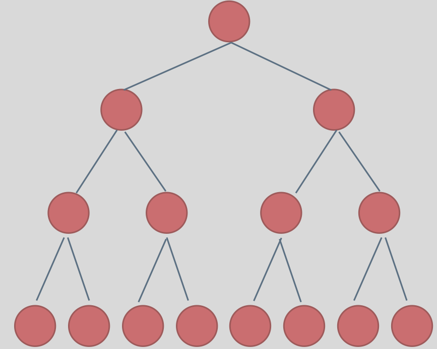
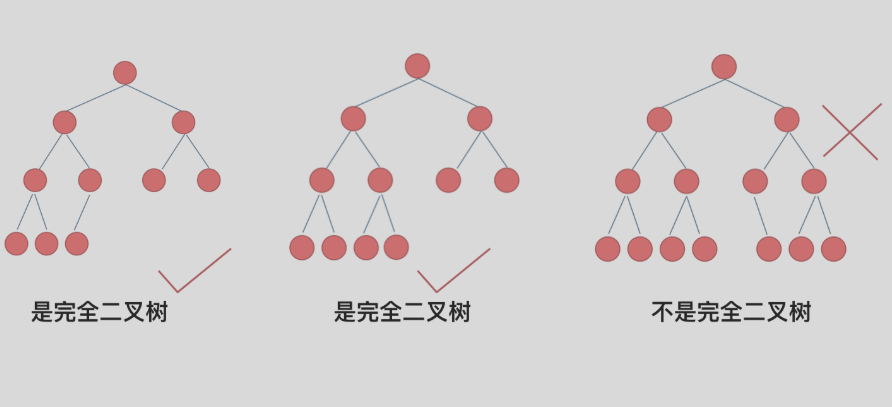
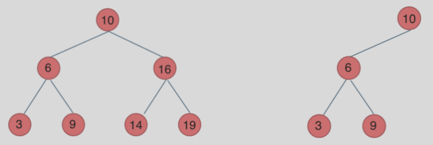
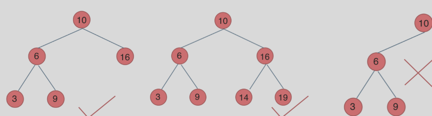

## 数组基础

- 在c++中数组，包括多维数组，地址都是连续的
- 在java中地址不对程序员暴露，寻址操作完成交给虚拟机，因此返回的数组或者对象地址都是经过处理的，并不是真正的地址


## 哈希表

当有要判断是否出现过的时候就可以想到哈希表方式来存储数据然后做比较了。

有**数组、set、map**三种选项来做哈希表。

- 数组：当数据量小的时候
- set：当数据量大的时候，几百万、几亿


## 二叉树

- 满二叉树：所有子节点都存在，并且只有度为0和度为2的结点，度为0的节点都在同一排。`节点数 = 2^k - 1`

  

- 完全二叉树：最底层的叶子节点可能没填满。

  

- 二叉搜索树：对于所有父节点而言，所有左子树都小于父节点，所有右子树都大于父节点。`O(logn)`

  

- 平衡二叉搜索树：在二叉搜索树中，对于所有左子树和右子树而言，相差高度不能超过一。

  

- 深度优先索索（前中后序遍历），广度优先遍历（队列的形式）。

- 二叉树的定义：

  ```java
  public class TreeNode {
      int val;
      TreeNode left;
      TreeNode right;
  
      TreeNode() {}
      TreeNode(int val) { this.val = val; }
      TreeNode(int val, TreeNode left, TreeNode right) {
          this.val = val;
          this.left = left;
          this.right = right;
      }
  }
  ```


