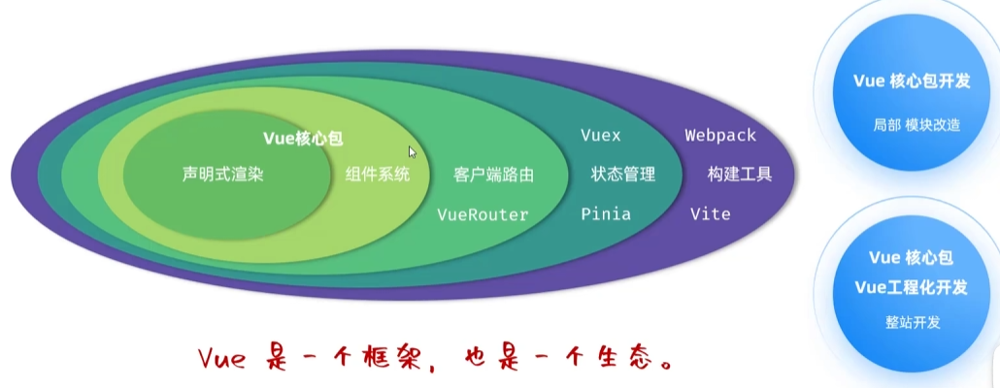
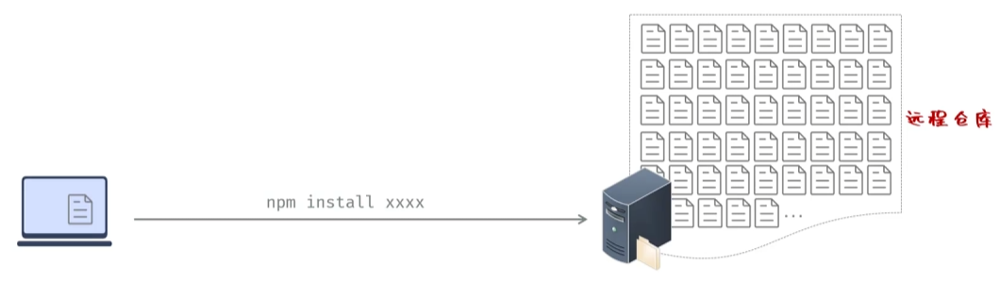
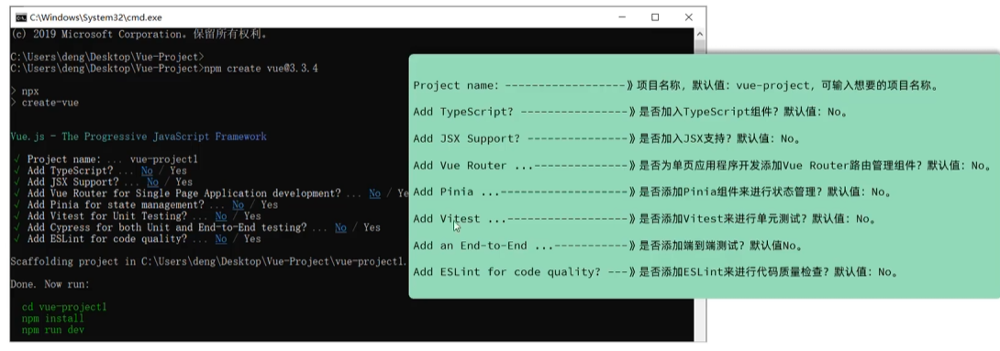
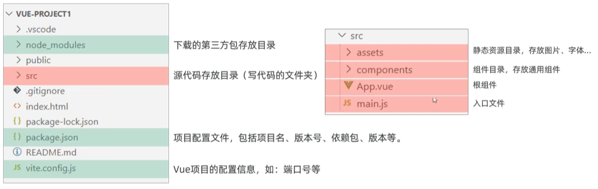
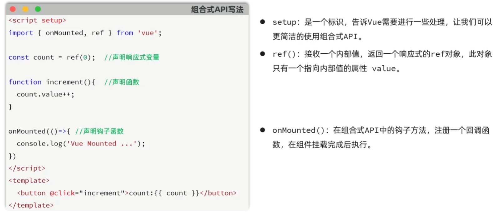
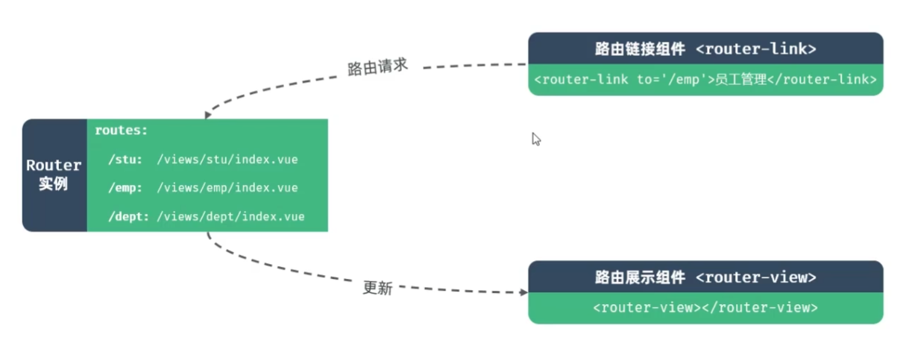

# 1、Vue工程化

## 1.1 介绍

- vue：一款用于**构建用户界面**的**渐进式**的JavaScript框架。

  

- npm：Node Package Manager，是Node JS的软件包管理器。

  

## 1.2 项目创建

- 创建一个工程化的Vue项目，执行命令：`npm create vue@3.3.4`

提示：执行以上指令，会安装并执行 create-vue，是Vue官方的项目脚手架工具。

## 1.3 项目结构

## 1.5 组合式API

注意：在Vue中的组合式API使用时，是没有this对象的，this对象是undefined。

 

# 2、Vue Router

- VueRouter：Vue的官方**路由**。为Vue提供富有表现力、可配置的、方便的**路由**。
- Vue中的路由：**路径**与**组件**的对应关系

- 组成：
  1. Router实例：路由实例，基于createRouter函数创建，维护了应用的路由信息。
  2. \<router-Link>：路由链接组件，浏览器会解析成\<a>。
  3. \<router-view>：动态视图组件，用来渲染展示与路由路径对应的组件。

