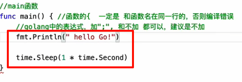
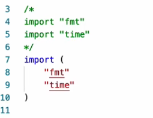
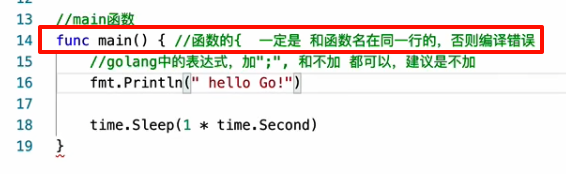
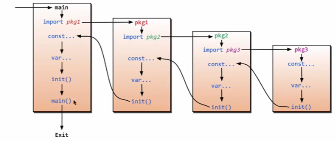
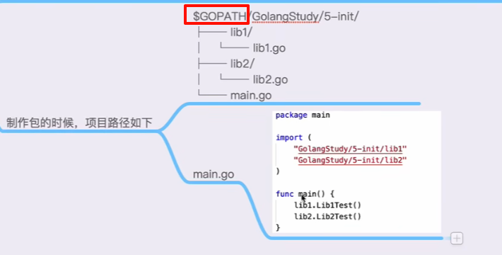
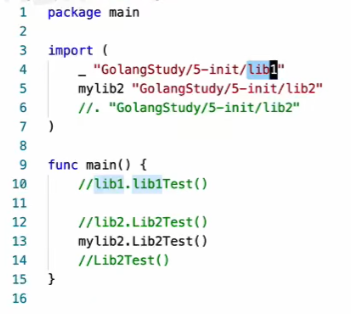
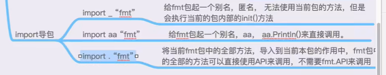

## 1、简单认识go

- golang表达式中可加可不加 “;“  建议是不加

  

- 导包

  

- 函数花括号一定在同一行，否则编译错误

  

## 2、四种变量声明方式

~~~go
package main

import "fmt"

//声明全局变量方法一、方法二、方法三是可以的
var gA int = 100
var gB = 200
//用方法四来声明全局变量
//:=只能够用在函数体内来声明
//gC := 200

func main() {
    //方法一：声明一个变量默认的值是0
    var a int
    fmt.Println("a = ", a)
    fmt.Printf("type of a = %T\n", a)

    //方法二：声明一个变量，初始化一个值
    var b int = 100
    fmt.Println("b = ", b)
    fmt.Printf("type of b = %T\n", b)
    var bb string = "abcd"
    fmt.Printf("bb = %s, type of bb = %T\n", bb, bb)

    //方法三：在初始化的时候，可以省去数据类型，通过值自动匹配当前的变量的数据类型
    var c = 100
    fmt.Println("c = ", c)
    fmt.Printf("type of c = %T\n", c)
    var cc = "abcd"
    fmt.Printf("cc = %s, type of cc = %T\n", cc, cc)

    //方法四：（常用的方法）省去var关键字，直接自动匹配
    e := 100
    fmt.Println("e = ", e)
    fmt.Printf("type of e = %T\n", e)

    f := "abcd"
    fmt.Println("f = ", f)
    fmt.Printf("type f = %T\n", f)

    g := 3.14
    fmt.Println("g = ", g)
    fmt.Printf("type g = %T\n", g)

    // =====
    fmt.Println("gA=“, gA, “, gB=", gB)
    //fmt.Println("gC=", gC)
    
    //声明多个变量
    var xx, yy int = 100, 200
    fmt.Println("xx = ", xx, ", yy = ", yy)
    var kk, ll = 100, "Aceld"
    fmt.Println("kk = ", kk, ", ll = ", ll)
    //多行的多变量声明
    var (
    	vv int = 100
    	jj bool = true
    )
    fmt.Println("vv = ", vv, ", jj = ", jj)
	gg, ee := 3.14, "abcd"
	fmt.Println("gg = ", gg, ", ee = ", ee)
}
~~~

## 3、const和iota

~~~go
package main

import "fmt"

//const来定义枚举类型
const (
    //可以在const()添加一个关键字iota，每行的iota都会累加1，第一行的iota的默认值是0
    BEIJING = 10 * iota //iota=0
    SHANGHAI			//iota=1
    SHENZHEN			//iota=2
)

const (
    a, b = iota + 1, iota + 2 // iota = 0, a = iota + 1, b = iota + 2, a = 1, b = 2
    c, d					  // iota = 1, c = iota + 1, d = iota + 2, a = 2, b = 3
    e, f					  // iota = 2, e = iota + 1, f = iota + 2, a = 3, b = 4

    g, h = iota * 2, iota * 3 // iota = 3, g = iota * 2, h = iota * 3, g = 6, h = 9 
    i, k					  // iota = 4, i = iota * 2, k = iota * 3, g = 8, h = 12
)

func main() {
    // 常量（只读属性）
    const length int = 10
    fmt.Println("length = ", length)
    // Length = 100 // 常量是不允许修改的。
    fmt.Println("BEIJIGN = ", BEIJING)
    fmt.Println("SHANGHAI =", SHANGHAI)
    fmt.Println("SHENZHEN =", SHENZHEN)
    fmt.Println("a = ", a, " b = ", b)
    fmt.Println("c = ", c, " d = ", d)
    fmt.Println("e = ", e, " f = ", f)
    fmt.Println("g = ", g, " h = ", h)
    fmt.Println("i = ", i, " k = ", k)
    
    // iota只能够配合const()一起便用，iota只有在const进行累加效果。
    //var a int = iota
}
~~~

## 4、方法定义方式

~~~go
package main

import "fmt"

func foo1(a string, b int) int {
    fmt.Println("a = ", a)
    fmt.Println("b = ", b)

    c := 100

	return c
}

// 返回多个返回值，匿名的
func foo2(a string, b int) (int, int) {
    fmt.Println("---foo2---")
    fmt.Println("a = ", a)
    fmt.Println("b = ", b)
    
    return 666, 777
}

// 返回多个返回值，有形参名称的
func foo2(a string, b int) (r1 int, r2 int) {
    fmt.Println("---foo3---")
    fmt.Println("a = ", a)
    fmt.Println("b = ", b)
    
    // 给有名称的返回值变量赋值
    r1 = 1000
    r2 = 2000
    
    return
}

// 返回多个返回值，有形参名称的，同类型
func foo2(a string, b int) (r1, r2 int) {
    fmt.Println("---foo4---")
    fmt.Println("a = ", a)
    fmt.Println("b = ", b)
    
    // r1 r2 属于foo3的形参，初始化默认的值是0
    // r1 r2 作用域空间是foo3整个函数体的{}空间
    fmt.Println("ret1 = ", ret1, " ret2 = ", ret2)
    
    // 给有名称的返回值变量赋值
    r1 = 1000
    r2 = 2000
    
    return
}
          
func main() {
    c := foo1("abc", 555)
    fmt.Println("c = ", c)
    
    ret1, ret2 := foo2("haha", 999)
    fmt.Println("ret1 = ", ret1, " ret2 = ", ret2)
    
    ret1, ret2 = foo3("foo3", 333)
    fmt.Println("ret1 = ", ret1, " ret2 = ", ret2)
    
    ret1, ret2 = foo4("foo4", 333)
    fmt.Println("ret1 = ", ret1, " ret2 = ", ret2)
}
~~~

## 5、import导包路径和init()函数调用过程

## 6、匿名、别名导包方式

## 7、defer语句

defer关键词运用在方法中，并且执行的顺序是压栈方式（先进后出，后进先出），并且在return后运行，因为是在方法的 } 前执行。

~~~go
package main

import "fmt"

func deferFunc() int {
	fmt.Println("deferFunc")
	return 0
}

func returnFunc() int {
	fmt.Println("returnFunc")
	return 5
}

func returnAndDefer() int {
	defer deferFunc()
	return returnFunc()
}

var a int = 10

func main() {
	returnAndDefer()
}

/*
returnFunc
deferFunc
*/
~~~

