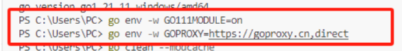

1. 安装go语言

2. 环境配置搭建好

3. GOROOT填写go安装目录；再Path中添加bin目录

4. 在工作环境下新建GOPATH目录

   ~~~bash
   gopath
   |————src
   |————bin
   |————pkg
   ~~~

5. 然后在系统环境和用户环境中都填写出GOPATH路径

6. 在终端中C:\Users\eeekuu目录下，运行下面两条代码

   

7. 然后再vscode中安装go插件