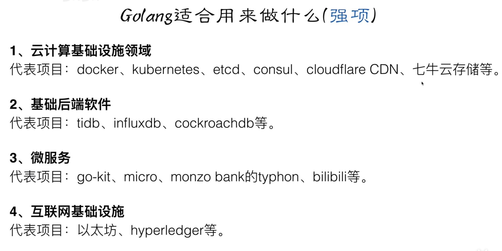
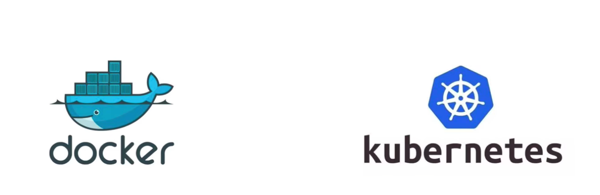

## 1、Golang的优势

1. 极其**简单的部署**方式
   - 可以直接编译成机器码
   - 不依赖其他库
   - 直接运行即可部署

2. **静态类型**语言：编译的时候检查出来隐藏的大多数问题

3. 语言层面的**并发**

   - 天生的基因支持：底层代码已经实现，不用再去考虑哪个多一点时间片

   - 充分的利用多核

4. **强大的标准库**
   - runtime系统调度机制
   - 高效的GC垃圾回收
   - 丰富的标准库

5. **简单易学**
   - 25个关键词
   - C语言简介基因，内嵌C语法支持
   - 面向对象特征（继承、多态、封装）
   - 跨平台

6. 大厂开路**（可以去了解的开源项目）**
   - Google：kubernetes（k8s）等
   - facebook（开源组织：facebookgo）：项目：grace等
   - Tencent：doker等
   - Baidu：BFE，百度云盘Go版本
   - JD：
   - ...

## 2、Go强势（项目）

## 3、Go不足

1. 包管理，大部分都在Github上，第三方私有库，不利于管理，安全性不足
2. **无泛化类型**，泛化类型：好处：方便写代码；坏处：代码的复杂度和难度更大
3. 所有**Exception**都用**Error**来处理，与java相反
4. 对**C**的降级处理，并非无缝，没有**C**降级到**asm**（汇编）那么完美（**序列化问题**）。go兼容c，但不是像C++那样的完全兼容。

