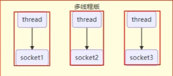
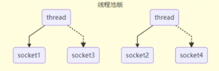
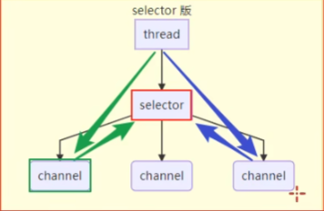
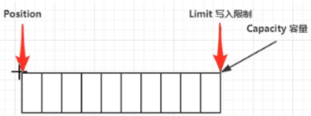
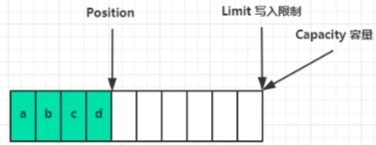
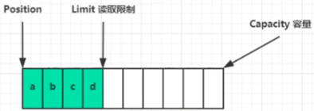
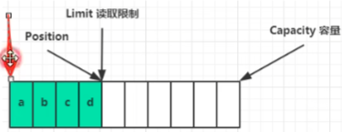
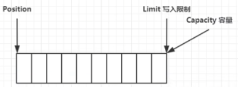
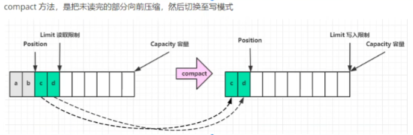

# NIO 基础

## 1. 三大组件

### 1.1 Channel & Buffer

Channel 通道，双向通道，区别于stream流，单向流。

Buffer 缓冲区，暂存数据，不管在Channel中输入或者输出数据，都得先进入Buffer缓冲区。

常见Channel：

- FileChannel - 文件传输
- DatagramChannel - UDP网络传输
- SocketChannel - TCP网络传输，客户端
- ServerSocketChannel - TCP网络传输，服务端

buffer则用来缓冲读写数据，常见的buffer有：

- ByteBuffer
  - MappedByteBuffer
  - DirectByteBuffer
  - HeapByteBuffer
- ShortBuffer
- IntBuffer
- LongBuffer
- FloatBuffer
- DoubleBuffer

### 1.2 Selector

#### 多线程设计



#### 多线程版缺点

- 内存占用高
- 线程上下文切换成本高
- 只适合连接数少的场景


#### 线程池版设计



#### 线程池版缺点

- 只运行在阻塞模式下，线程仅能处理一个 socket 连接
- 仅适合短连接场景


#### Selector 版设计

selector 配合一个线程管理多个 channel，获取channel上发生的事件，channel 工作在非阻塞模式下，不会让线程吊死在一个 channel 上。**适合连接数特别多，但流量低的场景**（low traffic）。



调用 selector 的 select() 会阻塞指导 channel 发生读写就绪事件，然后 select 方法就会返回这些事件交给 thread 处理。


# 2. ByteBuffer

```java
public static void main(String[] args) {
    // fileChannel
    // 获取：1. 输入输出流  2. RandomAccessFile

    try (FileInputStream fileInputStream = new FileInputStream("data.txt");
            FileChannel channel = fileInputStream.getChannel()) {
        // 准备缓冲区
        ByteBuffer buffer = ByteBuffer.allocate(10);
        while (true) {
            // 从 channel 中读取数据，向 byteBuffer 中写入
            int len = channel.read(buffer);
            if (len == -1) { // 没有内容了
                break;
            }
            // 打印 byteBuffer 中的内容
            buffer.flip(); // 切换至读模式
            while (buffer.hasRemaining()) { // 是否还有剩余未读数据
                byte b = buffer.get();
                System.out.println((char) b);
            }
            buffer.clear(); // 切换为写模式
        }
    } catch (IOException e) {
    }
}
```


## 2.1 ByteBuffer 正确使用姿势

1. 向 buffer 写入数据，例如调用 channel.read(buffer)
2. 调用 flip() 切换至**读模式**
3. 向 buffer 读取数据，例如调用 buffer.get()
4. 调用 clear() 或 compact() 切换至**写模式**
5. 重复 1~4 步骤


## 2.2 ByteBuffer 结构

ByteBuffer 有以下重要属性

- capacity
- position
- limit

一开始



写模式下，position 是写入位置，limit 等于容量大小，下图表示写入 4 个字节后的状态



flip 动作发生后，切换为读模式，position 位于起始位置，limit 位于读取限制



读取 4 个字节后，状态



clear 动作发生后，切换为写模式，清空回到初始位置



compact 方法也是切换至写模式，只不过是将未读取的数据向前压缩，position 位于数据后的位置




## 2.3 ByteBuffer 常见方法

#### 分配空间

可以使用 allocate 或者 allocateDirect 分配空间

~~~java
// java 堆内存，读写速率低，受到 GC 影响
Bytebuffer buf = ByteBuffer.allocate(16);
// 直接内存，读写速率高，不受 GC 影响，但是分配内存时时间长，如果数据清理不干净可能出现数据泄露的风险
Bytebuffer buf = ByteBuffer.allocateDirect(16);
~~~


#### 向 buffer 写入数据

有两种办法

- 调用 channel 的 read 方法
- 调用 buffer 自己的 put 方法

~~~java
int readBytes = channel.read(buf);
和
buf.put((byte) 127);
~~~


#### 从 buffer 读取数据

同样有两种办法

- 调用 channel 的 write 方法
- 调用 buffer 自己的 get 方法

~~~java
int writeBytes = channel.write(buf);
和
byte b = buf.get();
~~~

get 方法会让 position 读指针向后走，如果想重复读取数据

- 可以调用 rewind 方法将 position 重新置为0
- 或者调用 get(int i) 方法获取索引 i 的内容，它不会移动读指针

也可以利用 mark() 方法进行标记，这样使用 rewind 方法后就会自动跳转到 mark 位置


#### 字符串与 ByteBuffer 互转

```java
// 1. 字符串转为 ByteBuffer
ByteBuffer buffer1 = ByteBuffer.allocate(16);
buffer1.put("hello".getBytes());
debugAll(buffer1);

// 2. Charset
ByteBuffer buffer2 = StandardCharsets.UTF_8.encode("hello");
debugAll(buffer2);

// 3. wrap
ByteBuffer buffer3 = ByteBuffer.wrap("hello".getBytes());
debugAll(buffer3);

// 4. 转为字符串  CharBuffer 是 java.nio.HeapCharBuffer
CharBuffer decode1 = StandardCharsets.UTF_8.decode(buffer3);
System.out.println(decode1);

buffer1.flip();
CharBuffer decode2 = StandardCharsets.UTF_8.decode(buffer1);
System.out.println(decode2);
```


## 2.4 ByteBuffer 粘包半包问题

网络上有多条数据发送给服务端，数据之间使用 \n 进行分隔
但由于某种原因这些数据在按收时，被进行了重新组合，例如原始数据有3条为

~~~bash
Hello,word\n
I'm zhangsan\n
How are you?\n
~~~

变成了下面的两个 byteBuffer（黏包，半包）
~~~bash
Hello,world\nI'm zhangsan\nHo
w are you?\n
~~~

粘包：多条消息结合在一起

半包：一条消息被截断分成多段发送

粘包半包解决：

```java
public static void main(String[] args) {
    ByteBuffer buffer = ByteBuffer.allocate(32);
    buffer.put("Hello,word\nI'm zhangsan\nHo".getBytes());
    split(buffer);
    buffer.put("w are you?\n".getBytes());
    split(buffer);
}

public static void split(ByteBuffer source) {
    source.flip();
    for (int i = 0; i < source.limit(); i++) {
        if (source.get(i) == '\n') {
            int len = i + 1 - source.position();
            ByteBuffer allocate = ByteBuffer.allocate(len);
            for (int j = 0; j < len; j++) {
                allocate.put(source.get());
            }
            debugAll(allocate);
        }
    }
    source.compact();
}
```


# 3. 文件编程

## 3.1 两个 Channel 传输数据

```java
    public static void main(String[] args) {
//        try (
//                FileChannel from = new FileInputStream("data.txt").getChannel();
//                FileChannel to = new FileOutputStream("to.txt").getChannel();
//        ) {
//            from.transferTo(0, from.size(), to);
//        } catch (IOException e) {
//            e.printStackTrace();
//        }
        try (
                FileChannel from = new FileInputStream("data.txt").getChannel();
                FileChannel to = new FileOutputStream("to1.txt").getChannel();
        ) {
            to.transferFrom(from, 0, from.size());
        } catch (IOException e) {
            e.printStackTrace();
        }
    }
```

fransferTo 或 fransferFrom **传输效率高**，底层利用了操作系统的**零拷贝**进行实现，**2g 数据限额**。

针对 2g 数据限额，可以进行改造方法，进行多次传输

```java
public static void main(String[] args) {
    try (
            FileChannel from = new FileInputStream("data.txt").getChannel();
            FileChannel to = new FileOutputStream("to.txt").getChannel();
    ) {
        long size = from.size();
        for (long left = size; left > 0;) {
            System.out.println("position: " + (size - left) + " left: " + left);
            left -= from.transferTo(size - left, left, to);
        }
    } catch (IOException e) {
        e.printStackTrace();
    }
}
```


## 3.2 Path

jdk7 引入了 Path 和 Paths 类

- Path 用来**表示文件路径**
- Paths 是**工具类**，用来**获取Path实例**

~~~java
Path source = Paths.get("1.txt"); // 相对路径使用 user.dir 环境变量来定位 1.txt
Path source = Paths.get("d:\\1.txt"); // 绝对路径代表了 d:\1.txt
Path source = Paths.get("d：/1.txt"); // 绝对路径同样代表了d：\1.txt
Pthh projects = Paths.get("d:\\data"，"projects"); // 代表了 d:\data\projects
~~~

- `.`代表了当前路径
- `..`代表上一级路径


## 3.3 Files

##### 检查文件是否存在

~~~java
Path path =Paths.get("helloword/data.txt");
System.out.println(Files.exists(path));
~~~


##### 创建一级目录

~~~java
Path path = Paths.get("helloword/d1");
Files.createDirectory(path)
~~~

- 如果目录已存在，会抛异常 FileAlreadyExistsException
- 不能一次创建多级目录，否则会抛异常 NoSuchFileException


##### 创建多级目录

~~~java
Path path=Paths.get（"he11oword/d1/d2");
Files.createDirectories(path);
~~~


##### 拷贝文件

~~~java
Path source = Paths.get("helloword/data.txt");
Path target = Paths.get("helloword/target.txt");

Files.copy(source, target);
~~~

- 如果文件已存在，会抛异常 FileAlreadyExistsException

如果希望用source覆盖掉target，需要用 StandardCopyOption 来控制

~~~java
Files.copy(source， target, StandardCopyOption.REPLACE_EXISTING);
~~~

与 transferTo 方法的效率差不多，也是底层系统实现


##### 移动文件

~~~java
Path source =Paths.get("helloword/data.txt");
Path target = Paths.get("helloword/data.txt");

Files.move(source, target， StandardCopyOption.AToMIC_MOVE);
~~~

- StandardCopyOption.ATOMIC_MOVE 保证文件移动的原子性


##### 删除文件

~~~java
Path target =Paths.get("helloword/target.txt");
Files.delete(target);
~~~

- 如果文件不存在，会抛异常 NoSuchFileException


##### 删除目录

~~~java
Path target = Paths.get("helloword/d1");
Files.delete(target);
~~~

- 如果目录还有内容，会抛异常DirectoryNotEmptyException


##### 遍历目录文件

```java
public static void main(String[] args) throws IOException {
    AtomicInteger dirCount = new AtomicInteger();
    AtomicInteger fileCount = new AtomicInteger();
    Files.walkFileTree(Paths.get("D:\\soft\\DevelopmentLanguages\\Java\\jre1.8.0_451"), new SimpleFileVisitor<Path>() {
        @Override
        public FileVisitResult preVisitDirectory(Path dir, BasicFileAttributes attrs) throws IOException {
            System.out.println("=====>" + dir.getFileName());
            dirCount.incrementAndGet();
            return super.preVisitDirectory(dir, attrs);
        }

        @Override
        public FileVisitResult visitFile(Path file, BasicFileAttributes attrs) throws IOException {
            System.out.println(file);
            fileCount.incrementAndGet();
            return super.visitFile(file, attrs);
        }
    });

    System.out.println("dir count: " + dirCount.get());
    System.out.println("file count: " + fileCount);
}
```


##### 遍历特定文件

```java
public static void main(String[] args) throws IOException {
    AtomicInteger jarCount = new AtomicInteger();

    Files.walkFileTree(Paths.get("D:\\soft\\DevelopmentLanguages\\Java\\jre1.8.0_451"), new SimpleFileVisitor<Path>() {
        @Override
        public FileVisitResult visitFile(Path file, BasicFileAttributes attrs) throws IOException {
            if (file.toString().endsWith(".jar")) {
                System.out.println(file);
                jarCount.incrementAndGet();
            }
            return super.visitFile(file, attrs);
        }
    });

    System.out.println("end with jar counts: " + jarCount);
}
```


