# 课程安排

- nosql 讲解
- 阿里巴巴架构演进
- nosql数据模型
- Nosql 四大分类
- CAP
- BASE
- Redis 入门
- Redis 安装（Windows & Linux服务器）
- 五大基本数据类型
  - String
  - List
  - Set
  - Hash
  - Zset
- 三种特殊数据类型
  - geo
  - hyperloglog
  - bitmap
- Redis 配置讲解
- Redis 持久化
  - RDB
  - AOF
- Redis 事务操作
- Redis 实现订阅发布
- Redis 主从复制
- Redis 哨兵模式
- 缓存穿透及解决方案
- 缓存击穿及解决方案
- 缓存雪崩及解决方案
- 基础API 之 Jedis 详解
- SpringBoot 集成 Redis 操作
- Redis 的实践分析


# Nosql 概述

网站瓶颈：

1. 数据量太大，一个机器放不下
2. 数据索引：单表超过300万就要建立索引
3. 访问量太大 

 

NoSQL = Not Only SQL （不仅仅是SQL）泛指非关系型数据库


## 1、**NoSQL特点**：解耦

- 方便拓展（数据之间没有关系，很好扩展！）

- 大数据量高性能（Redis 一秒写8万次 读11万次。NoSQL的缓存记录级，是一种细粒度的缓存，性能会比较高。）

- 数据类型是多样性的（不需要事先设计数据库，随去随用）

- 传统 RDBMS （关系型数据库） 和NoSQL

  ~~~
  RDBMS
  - 结构化组织
  - SQL
  - 数据和关系都存储在单独的表中 row col
  - 操作语言，数据定义语言
  - 严格的一致性
  - ...
  
  NoSQL
  - 不仅仅是数据
  - 没有固定的查询语言
  - 键值对存储，列存储，文档村粗和，图形数据库（社交关系）
  - 最终一致性
  - CAP定理和BASE （异地多活）  初级架构师！
  - 高性能，高可用，高扩展
  - ...
  ~~~

  

## 2、**3V+3高**：

大数据时代的3v：主要描述问题

1. 海量volume
2. 多样variety
3. 实时velocity

大数据时代的3高：主要是对程序的要求

1. 高并发
2. 高性能
3. 高扩展


# NoSQL的四大类型

## 1、KV键值对：

- 新浪：**Redis**
- 美团：Redis + Tair
- 阿里、百度：Redis + memecache

## 2、文档型数据库（bson格式-12进制 和json一样）：

- **MongoDB**
  - MongoDB是一个**基于分布式文件存储**的数据库，C++编写，主要用来处理大量的文档。
  - MongoDB是一个介于关系型数据库和非关系型数据库中的中间产品。MongoDB是非关系型数据库中功能最丰富、最像关系型数据库的。
- CouchDB

## 3、列存储数据库

- **HBase**
- 分布式文件系统

## 4、图关系数据库

- 不是存图片，而是放的关系，比如：朋友圈社交网络，广告推荐。
- **Neo4j**，InfoGrid


四者区别：

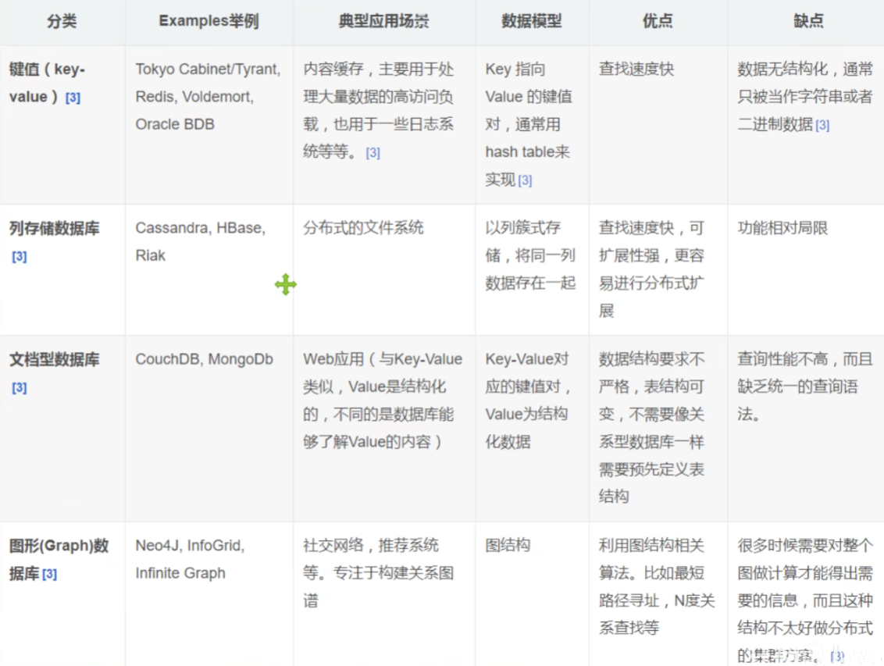


# Redis入门

## 1、概述

Redis（**R**emote **D**ictionary **S**erver），远程字典服务

是一个**开源**的使用ANSI [C语言](https://baike.baidu.com/item/C语言/105958?fromModule=lemma_inlink)编写、支持**网络**、可**基于内存亦可持久化**的**日志型**、**Key-Value**[数据库](https://baike.baidu.com/item/数据库/103728?fromModule=lemma_inlink)，并提供多种语言的**API**。


**作用**：

1. 内存存储、持久化，内存中是断电即失，持久化很重要（RDB、AOF）
2. 效率高，可用于高速缓存
3. 发布订阅系统（消息队列）
4. 地图信息分析
5. 计时器、计数器（浏览量）
6. ...


**特性**：

1. 多样的数据类型，键值型
2. 支持数据持久化
3. 单线程，每个命令具备原子性
4. 支持主从集群，分片集群
5. 低延迟、速度快（**基于内存**，IO多路复用，良好的编码）
6. 支持多语言客户端


## 2、命令

### 2.1 数据结构

Redis是一个key-value的数据库，key一般是String类型，不过value的类型多种多样：

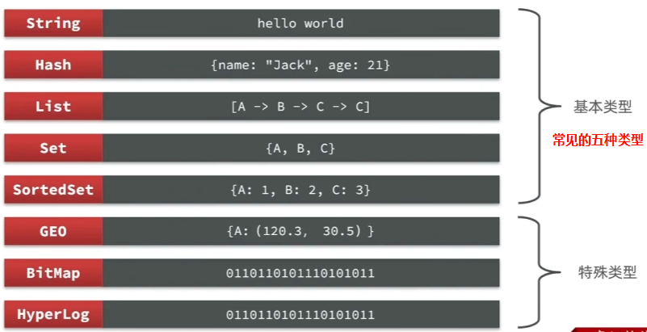


### 2.2 通用命令

通用指令是部分数据类型的，都可以使用的指令，常见的有：

- KEYS：查看符合模板的所有key，不建议在生产环境设备上使用
- DEL：删除一个指定的key
- EXISTS：判断key是否存在
- EXPIRE：给一个key设置有效期，有效期到期时该key会被自动删除
- TTL：查看一个KEY的剩余有效期

通过help[command]可以查看一个命令的具体用法，例如：

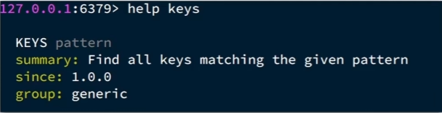


### 2.3 String类型

String类型，也就是字符串类型，是Redis中最简单的存储类型。
其value是字符串，不过根据字符串的格式不同，又可以分为3类：

- string：普通字符串
- int：整数类型，可以做自增、自减操作
- float：浮点类型，可以做自增、自减操作

不管是哪种格式，底层都是字节数组形式存储，只不过是编码方式不同（数值类型会以二进制形式存储，字符串只能转换为对应的字节码）。**字符串类型的最大空间不能超过512m**。

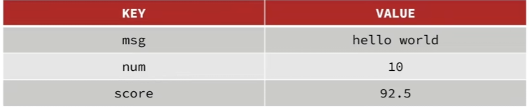


- **常见命令**：
  - SET：添加或者修改已经存在的一个String类型的键值对
  - GET：根据key获取String类型的value
  - MSET：批量添加多个String类型的键值对
  - MGET：根据多个key获取多个String类型的value
  - INCR：让一个整型的key自增1
  - INCRBY:让一个整型的key自增并指定步长，例如：incrby num 2 让num值自增2
  - INCRBYFLOAT：让一个浮点类型的数字自增并指定步长
  - SETNX：添加一个String类型的键值对，前提是这个key不存在，否则不执行
  - SETEX：添加一个String类型的键值对，并且指定有效期

**注意**：浮点数的自增必须指定步长，没有默认值。


### 2.4 Key的层级格式

Redis的key允许有多个单词形成层级结构，多个单词之间用：隔开，格式如下：

~~~sh
项目名:业务名:类型:id
~~~

这个格式并非固定，也可以根据自己的需求来删除或添加词条。

例如我们的项目名称叫heima，有user和product两种不同类型的数据，我们可以这样定义key：

- user相关的key：==heima:user:1==
- product相关的key：==heima:product:1==


如果Value是一个Java对象，例如一个User对象，则可以将对象序列化为JSON字符串后存储：

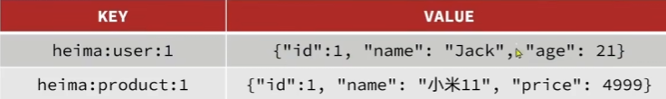


### 2.5 Hash类型

Hash类型，也叫散列，其value是一个无序字典，类似于Java中的HashMap结构。

String结构是将对象序列化为JSON字符串后存储，当需要修改对象某个字段时很不方便：

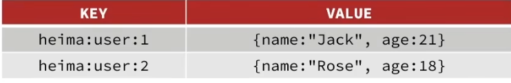

Hash结构可以将对象中的每个字段独立存储，可以针对单个字段做CRUD：

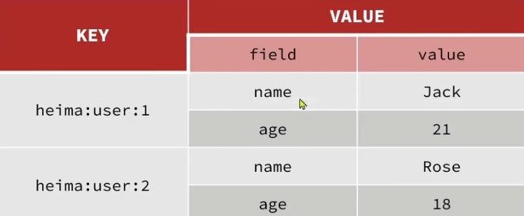

**Hash的常见命令**：

- HSET key field value：添加或者修改hash类型key的field的值
- HGET key field：获取一个hash类型key的field的值
- HMSET：批量添加多个hash类型key的field的值
- HMGET：批量获取多个hash类型key的field的值
- HGETALL：获取一个hash类型的key中的所有的field和value
- HKEYS：获取一个hash类型的key中的所有的field
- HVALS：获取一个hash类型的key中的所有的value
- HINCRBY:让一个hash类型key的字段值自增并指定步长
- HSETNX：添加一个hash类型的key的field值，前提是这个field不存在，否则不执行

**与String区别**：

- Hash是操作的字段 feild，而String操作的是键 key。


### 2.6 List类型

Redis中的List类型与Java中的**LinkedList**类似，可以看做是一个双向链表结构。既可以支持正向检索和也可以支持反向检索。

特征也与LinkedList类似：

- **有序**
- **元素可以重复**
- 插入和删除**快**
- 查询速度**一般**

常用来存储一个有序数据，例如：朋友圈点赞列表，评论列表等。

**List的常见命令**有：

- LPUSH key element ...：向列表左侧插入一个或多个元素
- LPOP key：移除并返回列表左侧的第一个元素，没有则返回nil
- RPUSH key element ...：向列表右侧插入一个或多个元素
- RPOP key：移除并返回列表右侧的第一个元素
- LRANGE key star end：返回一段角标范围内的所有元素，角标从0开始
- BLPOP和BRPOP：与LPOP和RPOP类似，只不过在没有元素时等待指定时间，而不是直接返回nil

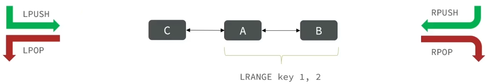

**用法**：

- 利用List结构**模拟一个栈**
  - 入口和出口在**同一边**
- 利用List结构**模拟一个队列**
  - 入口和出口在**不同边**
- 利用List结构**模拟一个阻塞队列**
  - 入口和出口在**不同边**
  - 出队时**采用BLPOP或BRPOP**


### 2.7 Set类型

Redis的Set结构与Java中的HashSet类似，可以看做是一个value为null的HashMap。因为也是一个hash表，因此具备

与HashSet类似的**特征**：

- 无序
- 元素不可重复
- 查找快
- 支持交集、并集、差集等功能

**Set的常见命令**：

- SADD key member ...：向set中添加一个或多个元素
- SREM key member ...：移除set中的指定元素
- SCARD key：返回set中元素的个数
- SISMEMBER key member：判断一个元素是否存在于set中
- SMEMBERS：获取set中的所有元素
- **SINTER** key1 key2 ...：求key1与key2的**交集**
- **SDIFF** key1 key2 ...：求key1与key2的**差集**
- **SUNlON** key1 key2 ..：求key1和key2的**并集**

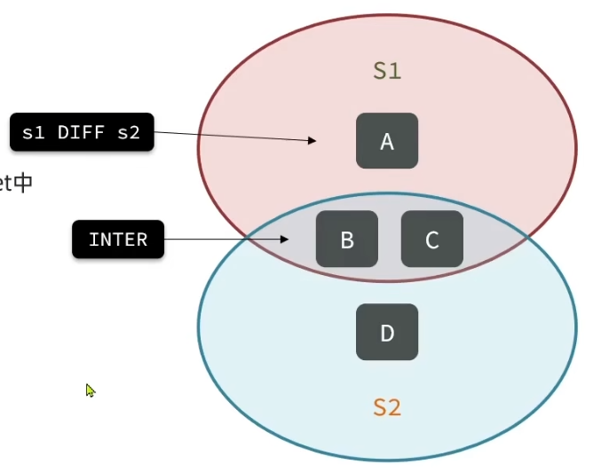


### 2.8 SortedSet类型

添加元素少的时候使用压缩表ziplist，当数据多了就转成跳表skiplist

Redis的SortedSet是一个可排序的set集合，与Java中的TreeSet有些类似，但底层数据结构却差别很大。SortedSet中的每一个元素都带有一个score属性，可以基于score属性对元素排序，底层的实现是一个跳表（SkipList）加hash表。

SortedSet具备下列**特性**：

- 可排序
- 元素不重复
- 查询速度快

因为SortedSet的**可排序特性**，经常被用来**实现排行榜**这样的功能。

**SortedSet的常见命令**：

- ZADD key score member：添加一个或多个元素到sortedset，如果已经存在则更新其score值
- ZREM key member：删除sortedset中的一个指定元素
- ZSCORE key member：获取sortedset中的指定元素的score值
- ZRANK key member：获取sortedset中的指定元素的排名
- ZCARD key：获取sortedset中的元素个数
- ZCOUNT key min max：统计score值在给定范围内的所有元素的个数
- ZINCRBY key increment member：让sortedset中的指定元素自增，步长为指定的increment值
- ZRANGE key min max：按照score排序后，获取指定排名范围内的元素
- ZRANGEBYSCORE key min max：按照score排序后，获取指定score范围内的元素
- ZDIFF、ZINTER、ZUNION：求差集、交集、并集

==**注意**==：所有的排名**默认都是升序**，如果要**降序则在命令的Z后面添加==REV==**即可。


## 3、java客户端

### 3.1 Jedis

#### 3.1.1 Jedis连接

**步骤**：

1. 引入依赖

   ~~~xml
   <!-- jedis -->
   <dependency>
       <groupId>redis.clients</groupId>
       <artifactId>jedis</artifactId>
       <version>3.7.0</version>
   </dependency>
   
   <!-- 单元测试 -->
   <dependency>
       <groupId>org.junit.jupiter</groupId>
       <artifactId>junit-jupiter</artifactId>
       <version>5.7.0</version>
       <scope>test</scope>
   </dependency>
   ~~~

   

2. 建立连接 -- 测试指令 -- 断开连接

   ~~~java
   private Jedis jedis;
   
   @BeforeEach
   public void setUp() {
       jedis = new Jedis("192.168.100.128", 6379);
       jedis.auth("123321");
       jedis.select(0);
   }
   
   @Test
   public void testString() {
       String result = jedis.set("name", "yuxuan");
       System.out.println("result : " + result);
       String name = jedis.get("name");
       System.out.println("name : " + name);
   }
   
   @Test
   public void testHash() {
       jedis.hset("user", "name", "yuxuan");
       jedis.hset("user", "age", "18");
       jedis.hset("user", "gender", "male");
   
       jedis.hgetAll("user")
               .forEach((k, v) -> System.out.println(k + " : " + v));
   }
   
   @AfterEach
   public void tearDown() {
       if (jedis != null) {
           jedis.close();
       }
   }
   ~~~

   

#### 3.1.2 Jedis连接池

**Jedis本身是线程不安全的**，并且频繁的创建和销毁连接会有性能损耗，因此我们推荐大家使用==Jedis连接池==代替Jedis的直连方式。

```java
public class JedisConnectionFactory {
    private static JedisPool jedisPool;

    static {
        // 配置连接池
        JedisPoolConfig jedisPoolConfig = new JedisPoolConfig();
        jedisPoolConfig.setMaxTotal(8);
        jedisPoolConfig.setMaxIdle(8);
        jedisPoolConfig.setMinIdle(8);
        jedisPoolConfig.setMaxWaitMillis(1000);
        // 连接池连接
        jedisPool = new JedisPool(jedisPoolConfig,
                "192.168.100.128", 6379, 1000, "123321");
    }

    public static Jedis getJedis() {
        return jedisPool.getResource();
    }
}
```


### 3.2 SpringDataRedis

SpringData是Spring中数据操作的模块，包含对各种数据库的集成，其中对Redis的集成模块就叫做SpringDataRedis，官网地址：https://spring.io/projects/spring-data-redis

- 提供了对不同Redis客户端的整合（Lettuce和Jedis）
- 提供了RedisTemplate统一APl来操作Redis
- 支持Redis的发布订阅模型
- 支持Redis哨兵和Redis集群
- 支持基于Lettuce的响应式编程
- 支持基于JDK、JSON、字符串、Spring对象的数据序列化及反序列化
- 支持基于Redis的JDKCollection实现

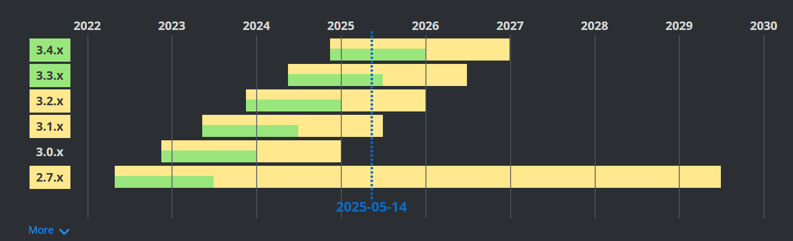


SpringDataRedis中提供了RedisTemplate工具类，其中**封装了各种对Redis的操作**。并且**将不同数据类型的操作API封装到了不同的类型中**：

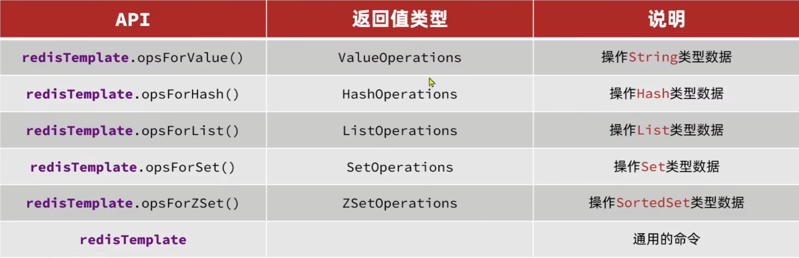


#### 3.2.1 RedisTemplate 入门

SpringBoot已经提供了对SpringDataRedis的支持，使用非常简单：

1. 引入依赖

   ~~~xml
   <!--Redis依赖-->
   <dependency>
   	<groupId>org.springframework.boot</groupId>
   	<artifactId>spring-boot-starter-data-redis</artifactId>
   </dependency>
   
   <!--连接池依赖-->
   <dependency>
   	<groupId>org.apache.commons</groupId>
   	<artifactId>commons-pool2</artifactId>
   </dependency>
   ~~~

2. 配置文件

   ~~~yml
   spring:
     redis:
       host: 192.168.150.101
       port: 6379
       password: 123321
       lettuce:
         pool:
           max-active: 8 #最大连接
           max-idle: 8 #最大空闲连接
           min-idle: 0 #最小空闲连接
           max-wait: 100 #连接等待时间
   ~~~

3. 注入RedisTemplate

   ~~~java
   @Autowired
   private RedisTemplate redisTemplate;
   ~~~

4. 编写测试

   ~~~java
   @SpringBootTest
   public class RedisTest {
   	@Autowired
   	private RedisTemplate redisTemplate;
   	@Test
   	void testString() {
   		// 插入一条string类型数据
   		redisTemplate.opsForValue().set("name", "李四");
   		// 读取一条string类型数据
   		Object name = redisTemplate.opsForValue().get("name");
   		System.out.println("name = " + name);
       }
   }
   ~~~


#### 3.2.2 SpringDataRedis序列化方式 -- 重写RedisTemplate

RedisTemplate可以接收任意Object作为值写入Redis，只不过写入前会把Object序列化为字节形式，默认是采用JDK序列化，得到的结果是这样的:

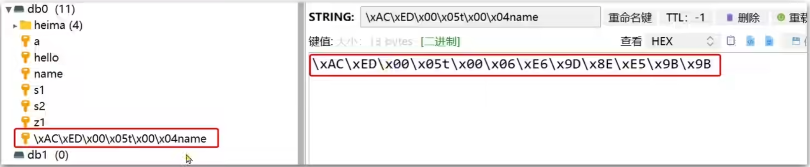

这是因为我们没有自定义序列化方式，所以采用JDK的序列化方式，对象流的方式进行存储为字节序列。

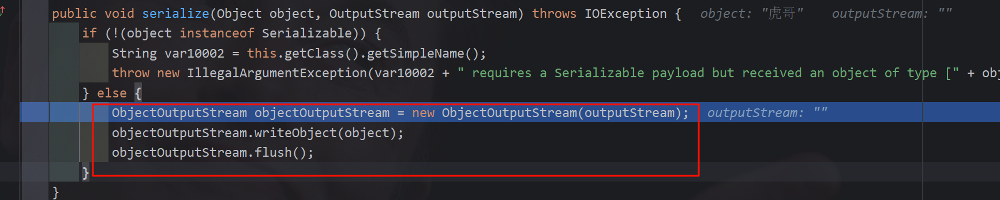

==**缺点**==：

- 可读性差
- 内存占用较大


**我们可以自定义RedisTemplate的序列化方式，代码如下:**

```java
@Configuration
public class RedisConfig {

    @Bean
    // RedisConnectionFactory是由commons-pool2的依赖注入
    public RedisTemplate<String, Object> redisTemplate(RedisConnectionFactory connectionFactory) {
        // 1. 创建RedisTemplate对象
        RedisTemplate<String, Object> redisTemplate = new RedisTemplate<>();

        // 2. 设置连接工程
        redisTemplate.setConnectionFactory(connectionFactory);

        // 3. 创建JSON序列化工具
        GenericJackson2JsonRedisSerializer jsonRedisSerializer = new GenericJackson2JsonRedisSerializer();

        // 4. 设置Key的序列化
        redisTemplate.setKeySerializer(RedisSerializer.string());
        redisTemplate.setHashKeySerializer(RedisSerializer.string());

        // 5. 设置Value的序列化
        redisTemplate.setValueSerializer(jsonRedisSerializer);
        redisTemplate.setHashValueSerializer(jsonRedisSerializer);

        // 6. 返回
        return redisTemplate;
    }
}
```


#### 3.2.3 SpringDataRedis序列化方式 -- 利用StringRedisTemplate手动实现序列化

尽管JSON的序列化方式可以满足我们的需求，但依然存在一些问题，如图:

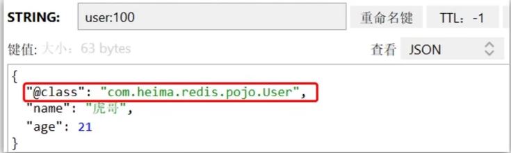

为了在反序列化时知道对象的类型，JSON序列化器会将类的class类型写入json结果中，存入Redis，，占用了大量空间，会带来额外的内存开销。

为了节省内存空间，通常不会使用JSON序列化器来处理value，而是统一使用String序列化器，要求只存储String类型的key和value。当需要存储java对象时，手动完成对象的序列化和反序列化。

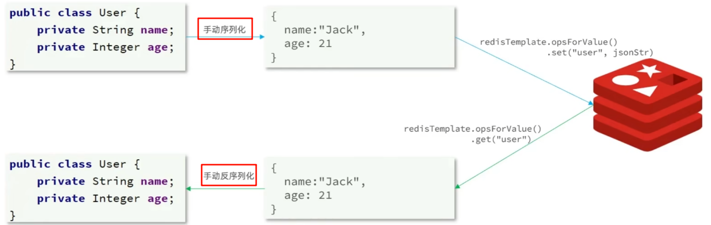

Spring默认提供了一个StringRedisTemplate类，它的key和value的序列化方式**默认就是String方式**。**省去了我们自定义RedisTemplate**的过程:

```java
@Autowired
private StringRedisTemplate stringRedisTemplate;
// JSON工具
private static final ObjectMapper mapper = new ObjectMapper();

@Test
void testSaveUser() throws JsonProcessingException {
    // 1. 准备对象
    User user = new User("虎哥", 21);

    // 2. 手动序列化
    String json = mapper.writeValueAsString(user);

    // 3. 写入数据
    stringRedisTemplate.opsForValue().set("user:200", json);

    // 4. 读取数据
    String s = stringRedisTemplate.opsForValue().get("user:200");

    // 5. 手动反序列化
    User user1 = mapper.readValue(s, User.class);

    // 6. 输出
    System.out.println("user1 = " + user1);
}
```

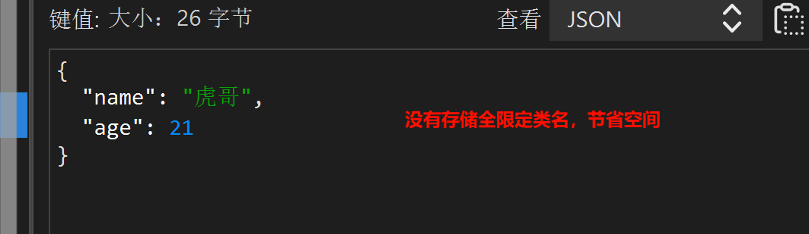


**RedisTemplate的两种序列化实践方案：**

- **方案一**：
  1. 自定义RedisTemplate
  2. 修改RedisTemplate的序列化器为GenericJackson2JsonRedisSerializer
- **方案二**：
  1. 使用StringRedisTemplate
  2. 写入Redis时，手动把对象序列化为JSON
  3. 读取Redis时，手动把读取到的JSON反序列化为对象


# Redis实战

## 1、短信登陆

### 1.1 **基于session实现登录**

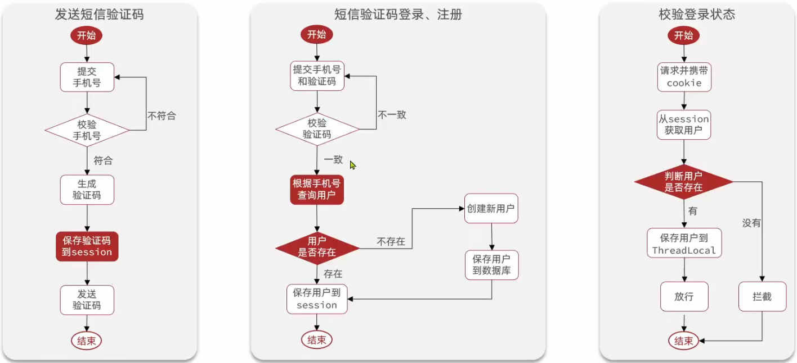


通过session进行存储的数据只能在同一个服务器中访问，但是如果有多个服务器形成的集群时，会出现session不共享问题，不知道是哪个用户的操作指令。因此用redis代替session进行存储数据是很有必要的，redis拥有着：1. 内存存储，读写速度快；2. key-value存储方式；3. 数据可共享。是代替session的不二之选。


### 1.2 **基于redis共享session登录**

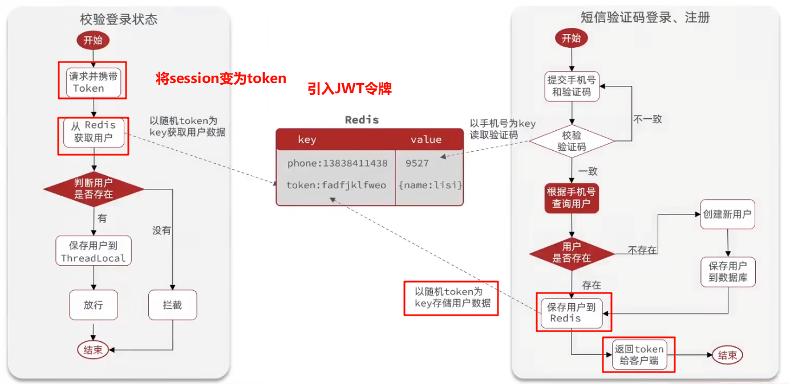


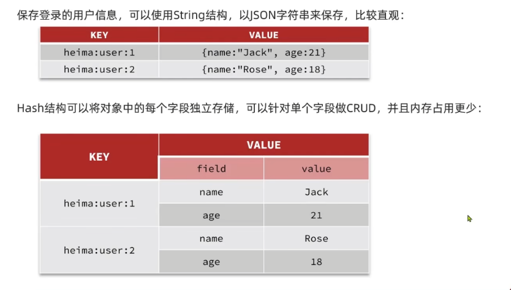

利用hash结构存储比Stiring结构更加直观，内存占用更少，并且在单个字段上的CRUD更加灵活。


**拦截器的优化**：

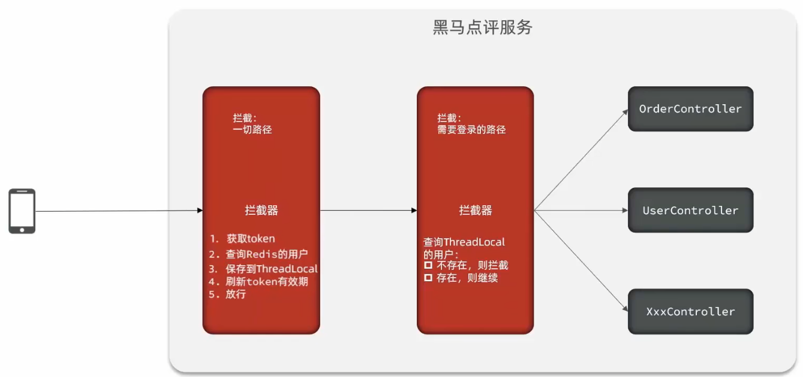


## 2、商品查询缓存

### 2.1 缓存

**缓存**是数据交换的缓冲区（称作Cache），是存储数据的临时地方，一般读写性能较高。

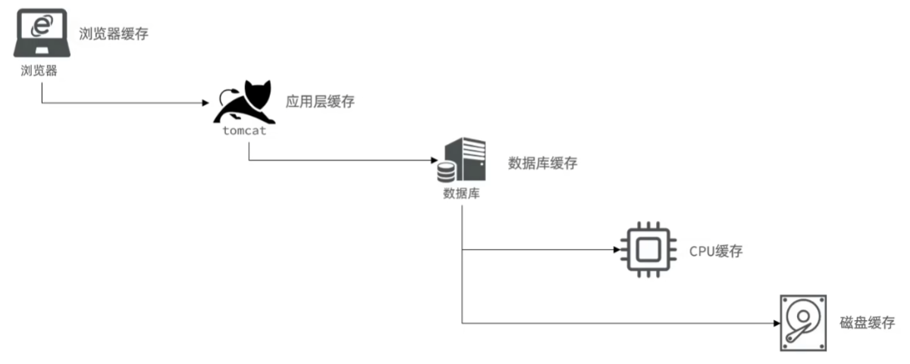

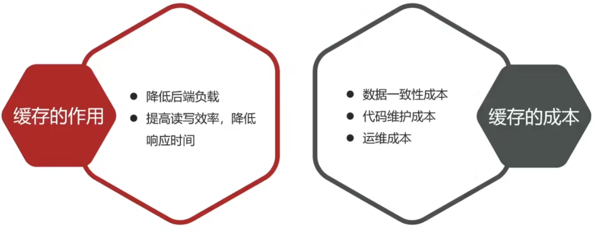


### 2.2 添加Redis缓存

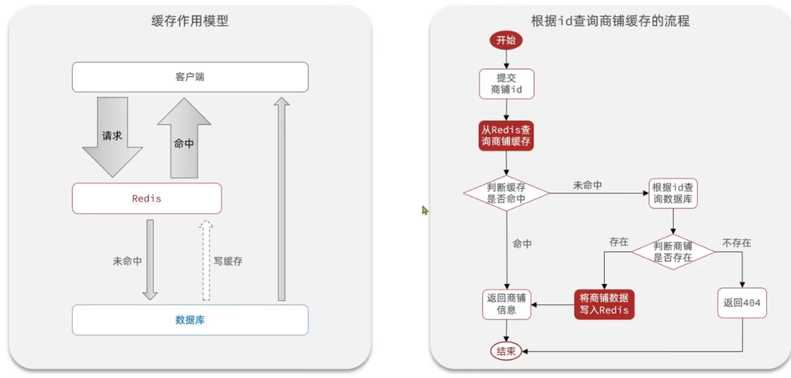


### 2.3 缓存更新策略

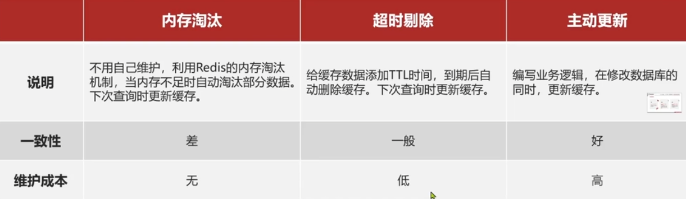

业务场景：

- 低一致性需求：使用内存需求机制。例如店铺类型的查询缓存。
- 高一致性需求：主动更新，并以超时剔除作为兜底方案。例如店铺详情查询的缓存。

#### 2.3.1 主动更新策略 -- 三种策略

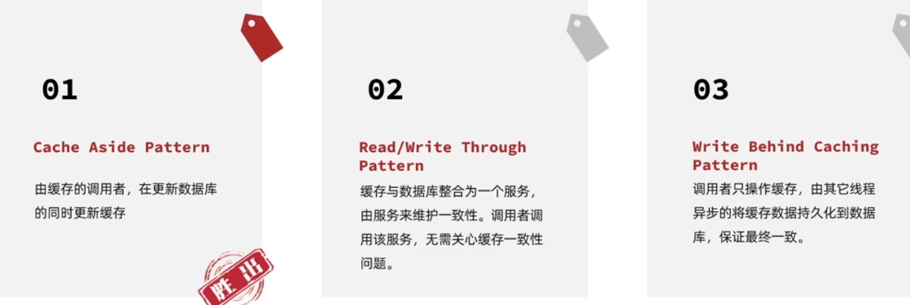

操作缓存和数据库时有三个问题需要考虑：

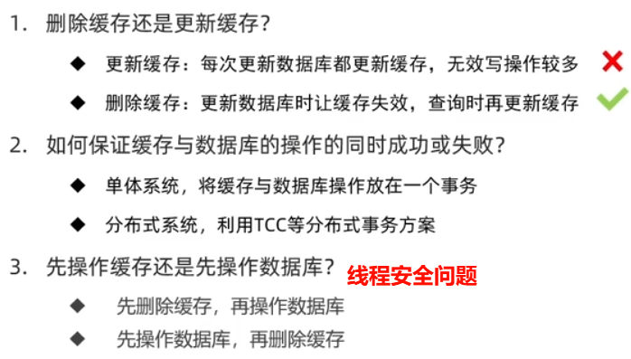

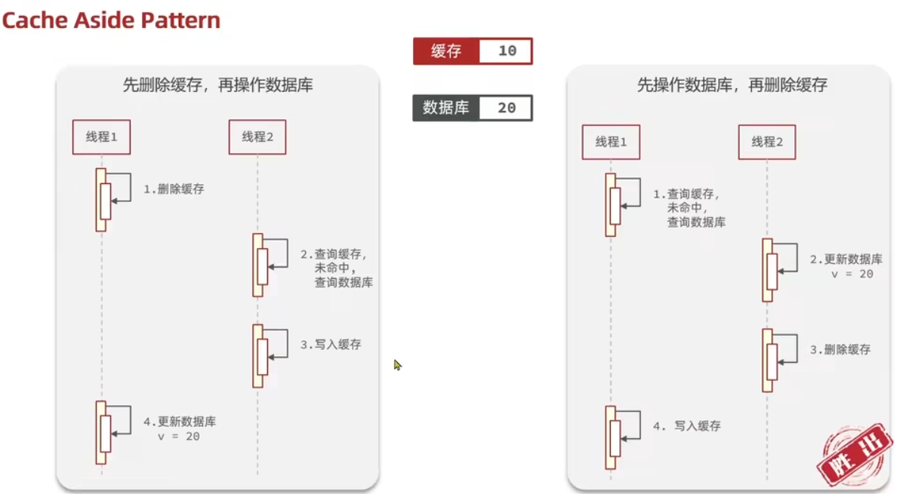

选择先操作数据库，再删除缓存。对于缓存的操作来说速度非常快，因此利用第二种方案更为合适。

读操作：

- 缓存命中则直接返回
- 缓存未命中则查询数据库，并写入缓存，设定超时时间。

写操作：

- 先写数据库，然后再删除缓存。
- 要确保数据库与缓存操作的原子性。


### 2.4 缓存穿透

**缓存穿透**是指客户端请求的数据在缓存中和数据库中都不存在，这样缓存永远不会生效，这些请求都会打到数据库。
常见的解决方案有两种：

- 缓存空对象
  - 优点：实现简单，维护方便
  - 缺点：
    - 额外的内存消耗
    - 可能造成短期的不一致
- 布隆过滤
  - 优点：内存占用较少，没有多余key
  - 缺点：
    - 实现复杂
    - 存在误判可能（布隆过滤显示不存在，那么一定不存在；但是显示存在，那么可能存在可能不存在）

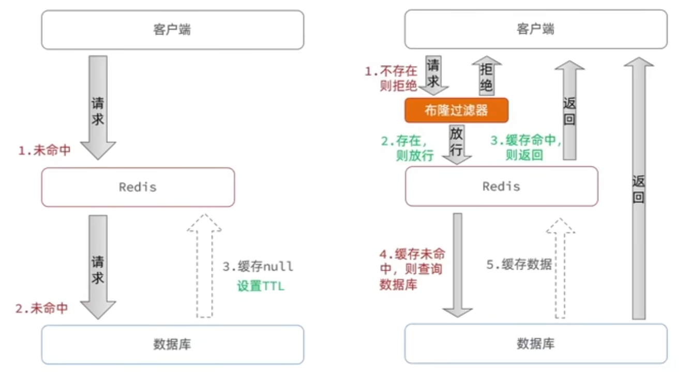

策略修改

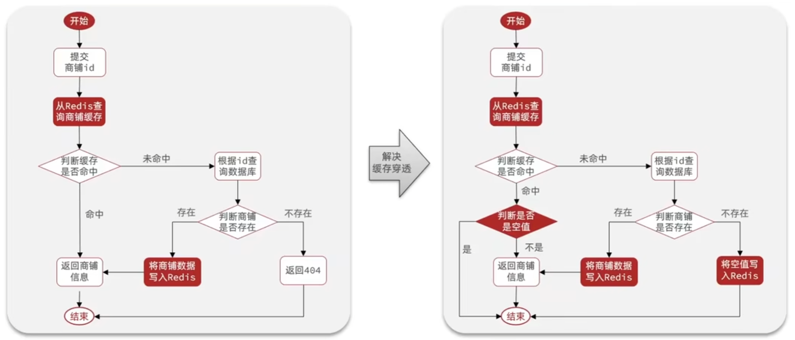


总结

缓存穿透产生的原因：

- 用户查询的数据在resdis缓存和数据库都不存在，但是用户不断地恶意发起请求，造成数据库的巨大压力。

解决办法：

- 缓存null值
- 布隆过滤
- 增强id的复杂度，避免被猜测id规律
- 做好数据的基础格式校验
- 加强用户权限校验
- 做好热点参数的限流


### 2.5 缓存雪崩

**缓存雪崩**是指在同一时段大量的缓存key同时失效或者Redis服务宕机，导致大量请求到达服务器，带来巨大压力。

**解决方案**：

- 给不同的key的TTL添加随机值
- 利用redis集群提高服务的可用性
- 给缓存业务添加降级限流策略
- 给业务添加多级缓存

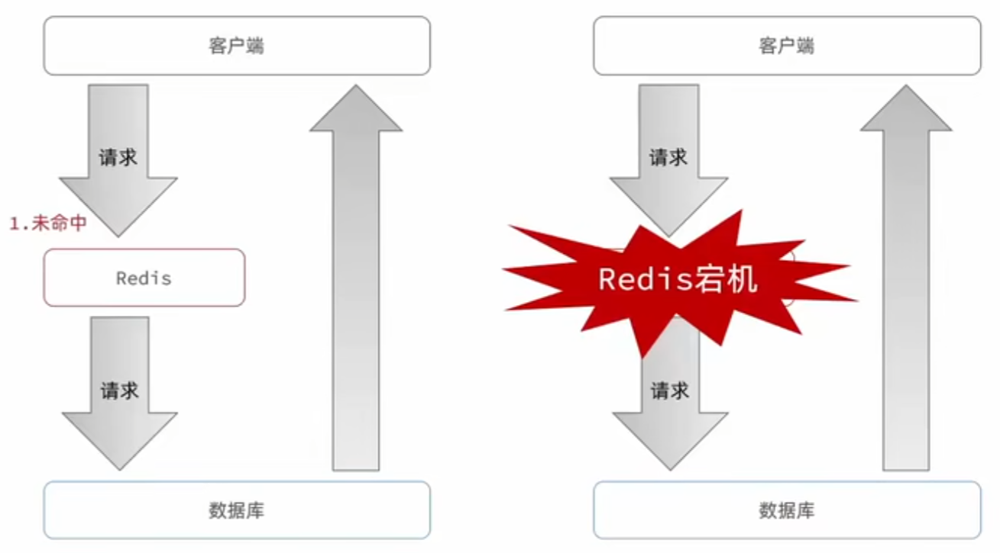


### 2.6 缓存击穿

**缓存击穿问题**也叫热点Key问题，就是一个被**高并发访问**并且**缓存重建业务较复杂**的key突然失效了，无数的请求访问会在瞬间给数据库带来巨大的冲击。

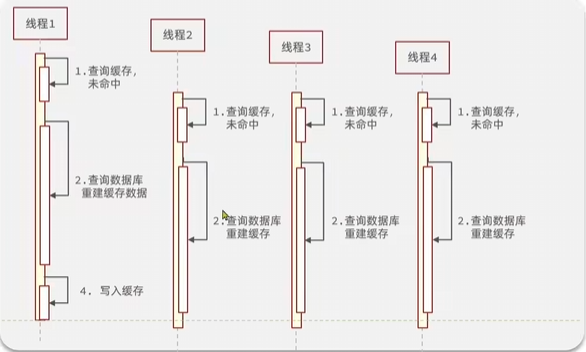

两种解决方案：

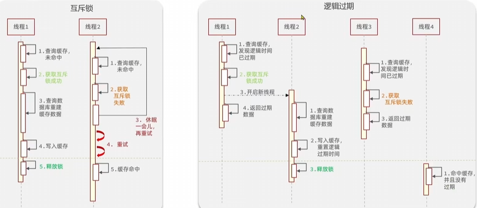

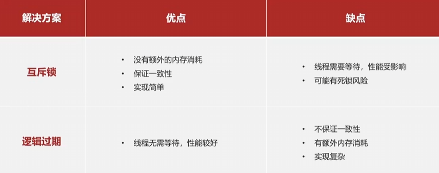

**互斥锁**：保证了一致性，损失了可用性。

**逻辑过期**：保证了可用性，损失了一致性。

案例：

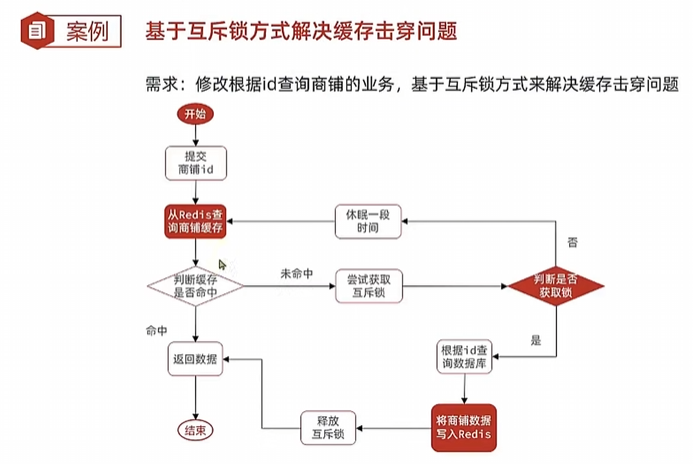

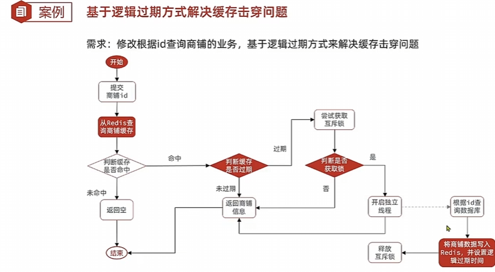


