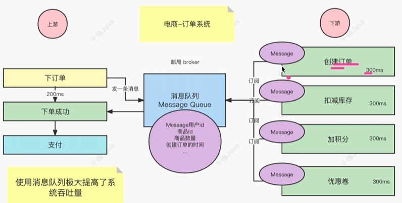

# 一、消息队列

消息队列 Message Queue，是一个队列，解决的不是存放消息的队列问题，而是解决的**通信问题**。

对于同步的消息，时间消耗太大，为了解决同步的损耗。用到了异步的通信方式对架构进行改造。

使用异步的方式对模块间的调用进行解耦，可以快速提升系统的吞吐量。上游执行完消息的发送业务后立即获得结果，下游多个服务订阅到消息后各自消费。通过消息队列，屏蔽底层的通信协议，使得解耦和并行消费得以实现。