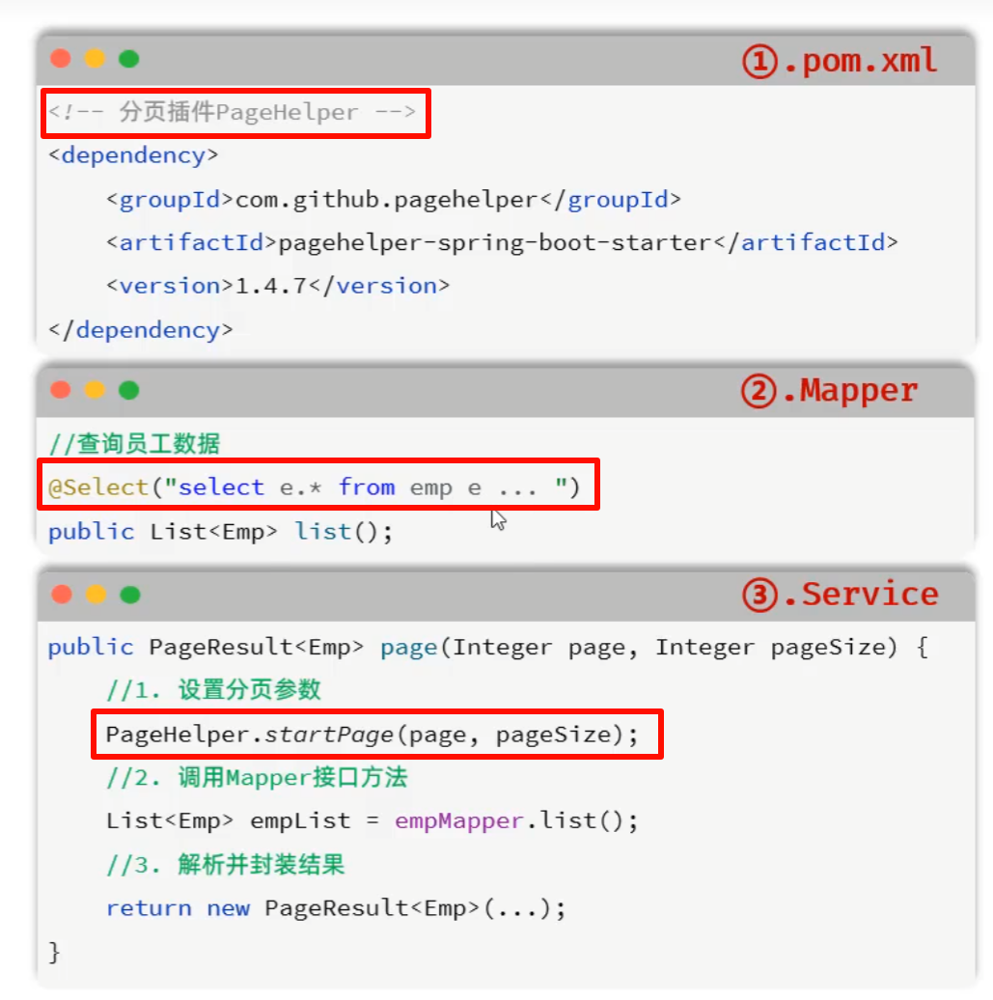

# JavaWeb

## 1、基本概念

- 静态web
  - html，css，js（伪动态）
  - 提供给所有人看的数据始终不会发生变化。
- 动态web
  - servlet/jsp，asp，php
  - 提供给所有人看的数据会发生变化，每个人在不同的时间，不同的地点看到的信息不同。


## 2、web应用程序

- 统一的web资源会被放在一个同一文件夹下，web应用程序 ---> Tomcat ：服务器
- 一个web应用程序由多个部分组成（静态web，动态web）
  - html，css，js
  - jsp，servlet
  - java程序
  - jar包
  - 配置文件（Properties）

web应用程序编写完毕后，若想提供给外界访问：需要一个服务器来同一管理。

### 2.1 静态web


缺点：

- web页面无法动态更新，所有用户看到的都是同一个页面
  - 轮播图，点击效果   --->  伪动态
  - JavaScript
- 无法和数据库交互（数据无法持久化，用户无法交互）

### 2.2 动态web


缺点：

- 加入服务器的动态web资源出现错误，需要重新编写**后台程序**，重新发布。
  - 停机维护

优点：

- web页面可以动态更新，所有用户看到的都不是同一个页面
- 可以和数据库交互（数据持久化：注册，商品信息，用户信息...）

### 2.3 技术讲解

1. ASP：
   - 微软推出，在前端代码中嵌入VB脚本：业务逻辑代码：维护成本高
   - C#
   - IIS

2. PHP：
   - 开发速度快，功能强大，跨平台，代码简单
   - 无法承载大访问量（局限性）
3. JSP/Servlet：
   - B/S：浏览和服务器
   - C/S：客户端和服务器
     - sun公司主推的B/S架构
     - 基于java语言
     - 可承载三高问题：高可用、高并发、高性能
     - 语言像ASP， ASP ---> JSP ，加快市场强度

### 2.4 web服务器

**Tomcat 实际上运行JSP页面和Servle**t，具有处理HTML页面的功能，另外它还是一个Servlet和JSP容器，独立的Servlet容器是Tomcat的默认模式。Tomcat最新版本为11.0.0**。**

Tomcat 技术先进、性能稳定，而且免费。


#### Tomcat


## 3、Http

超文本传输协议（Hypertext Transfer Protocol，HTTP）是**一个简单的请求-响应协议**，它通常运行在[TCP](https://baike.baidu.com/item/TCP/33012?fromModule=lemma_inlink)之上。它指定了客户端可能发送给服务器什么样的消息以及得到什么样的响应。请求和响应消息的头以[ASCII](https://baike.baidu.com/item/ASCII/309296?fromModule=lemma_inlink)形式给出；而消息内容则具有一个类似[MIME](https://baike.baidu.com/item/MIME/2900607?fromModule=lemma_inlink)的格式。超文本传输协议是一种用于分布式、协作式和超媒体信息系统的应用层协议，是万维网WWW（World Wide Web）的数据通信的基础。

- 端口：80

### 3.1 两个时代

- Http/1.0：客户端与web服务器连接后，只能获得一个web资源，断开连接。
- Http/1.1：客户端可以与web服务器连接后，可以获得多个web资源。

### 3.2 Http请求

- 客户端 --- 发出请求 --- 服务器

#### 3.2.1 请求行

- 请求行中的请求方式：Get、Post、Head、Delete、Put、Tract...
  - get：请求能够携带的参数比较少，大小有限制，会在浏览器中的**URL地址栏中显示内容**，**不安全，但是高效**
  - post：请求能够携带的参数不受限制，大小无限制，**不会**在浏览器中的URL地址栏中**显示内容****，**安全，但是不高效**

#### 3.2.2 消息头

~~~jajva
Accept：告诉浏览器，它所支持的数据类型
Accept-Encoding：支持哪种编码格式GBK UTF-8 GB2312 IS08859-1
Accept-Language：告诉浏览器，它的语言环境
Cache-Control：缓存控制
connection：告诉浏览器，请求完成是断开还是保持连接
HOST：主机...
~~~


### 3.3 Http响应

- 服务器 --- 响应 --- 客户端

#### 3.3.1 响应体

~~~java
Accept：告诉浏览器，它所支持的数据类型
Accept-Encoding：支持哪种编码格式GBK UTF-8 GB2312 IS08859-1
Accept-Language：告诉浏览器，它的语言环境
Cache-Control：缓存控制
connection：告诉浏览器，请求完成是断开还是保持连接
HOST：主机...
Refresh：告诉客户端，多久刷新一次
Location：让网页重新定位。
~~~

#### 3.3.2 响应状态码

200：请求响应成功     200
3xx：请求重定向

- 重定向：你重新到我给你新位置去；

4xx：找不到资源         404

- 资源不存在；

5xx：服务器代码错误  500    502：网关错误


# 黑马JavaWeb课程

java优点：

- 跨平台
- 安全
- 高效
- api齐全
- 历史悠久


## 1、单元测试 -- JUnit

Junit：最流行的Java测试框架之一，提供一些功能，方便程序进行单元测试（由第三方公司提供）。


### 1.1 常用断言方法

JUnit提供了一些辅助方法，用来帮我们确定被测试的方法是否按照预期的效果正常工作，这种方式称为**断言**。


作用：

- 单元测试方法运行不报错，不代表业务方法没问题；
- 通过断言的方式可以检测运行结果是否和预期结果一致，从而判断业务方法是否正确。


### 1.2 常见注解

一般“@ParameterizedTest”和“@ValueSource”搭配使用，Before一般是初始化工作，After一般是释放资源。


### 1.3 依赖范围


## 2、Maven常见问题解决


## 3、Http请求


## 4、Http响应


## 5、Http状态码


**注意**：响应状态码和响应头如果没有特殊要求，可以不用手动设置，一般服务器会根据请求处理的逻辑，自动设置响应状态码和响应头。


## 6、分层解耦

高耦合低内聚

### 6.1 三层架构


**好处**：

- 复用性强
- 方便维护


### 6.2 分层解耦


在bean中的对象名称默认为 对象首字符小写，后面字符不。


#### 6.2.1 IOC控制反转


**注意**：

- 在Springboot继承web开发中，声明控制器bean只能用@Controller。
- 声明bean的注解要想生效，需要被扫描到，启动类默认扫描当钱包及其子包。


#### 6.2.2 DI依赖注入


spring官方推荐构造函数注入方式，但是许多企业都运用的是属性注入方式。


**注意**：

- @Resource 与 @Autowired 的区别
  - @Autowired是spring框架提供的注解，而@Resource是JavaEE规范提供的
  - **@Autowired**默认是按照**类型**注入，而**@Resource**默认是按照**名称**注入


## 7、MySQL


### 7.1 DDL

- Data Definition Language，数据定义语言，**用来定义数据库对象**（**数据库，表，字段**）


默认utf8md4，功能强大，比较通用。


#### 7.1.1 表结构-创建：


需要主键自增用关键字 auto_increment


#### 7.1.2 数值类型：


#### 7.1.3 字符串类型：


#### 7.1.4 日期时间类型：


#### 7.1.5 表设计：

基础字段：id、create_time、update_time


#### 7.1.6 表查询、修改、删除：


### 7.2 DML

- DML全称是Data Manipulation Languoge(数据操作语言)，用**来对数据库中表的数据记录进行增、删、改操作**。


- 添加数据 ==INSERT==
- 修改数据 ==UPDATE==
- 删除数据 ==DELETE==

#### 7.2.1 INSERT


**注意**：

- 插入数据时，指定的字段顺序需要与值的顺序一一对应。
- **字符串和日期类型应该包含在引号中**（单引号、双引号都可以）。
- 插入的数据大小/长度，应该在字段的规定范围内。
- 添加日期时，可以利用 **new()** 函数进行添加当前时间。


#### 7.2.2 UPDATE


**注意**：

- 修改语句的条件可以有，也可以没有，**如果没有条件，则会修改整张表的所有数据。**


#### 7.2.3 DELETE


**注意**：

- DELETE语句的条件可以有，也可以没有，**如果没有条件，则会删除整张表的所有数据。**
- **DELETE语句不能删除某一个字段的值**（如果要操作，可以使用UPDATE，将该字段的值设置为NULL）。


### 7.3 DQL

- Data Query Language(数据查询语句)，用来查询数据库表中的数据。


#### 7.3.1 基本查询


**注意**：

- 当起别名的时候（as 别名1），最好加上 ' ' 单引号，防止中间出现空格或者其他符号影响别名设置。 as 可以省略。
- \* 号代表查询所有字段，在实际开发中尽量少用（不直观，影响效率）。


#### 7.3.2 条件查询


#### 7.3.3 分组查询

- ==聚合函数==：将一列数据作为一个整体，进行纵向计算。


~~~mysql
-- 1.统计该企业员工数量－count
-- count（字段）
select count(id）from emp;
             
-- count（*）：推荐  底层做了优化
select count(*)from emp;
             
-- count（常量）：推荐
select count(1） from emp;
~~~

**注意**：

- **null值不参与所有聚合函数的计算**
- 统计数量可以使用：count(\*)  count(字段)  count(常量)，推荐使用count(\*)


- where与having的区别:
  1. **执行时机不同**：where是分组之前进行过滤，不满足where条件，不参与分组；而having是分组之后对结果进行过滤。
  2. **判断条件不同**：**where不能对聚合函数进行判断，而having可以。**

**注意**：

- **分组之后，查询的字段一般为==聚合函数==和==分组字段==**，查询其他字段无任何意义。
- **执行顺序： where > 聚合函数 > having 。**


#### 7.3.4 排序查询


- 排序方式：升序(asc)(默认)，降序(desc)；**默认为升序asc，可以不写。**

**注意**：

- 如果是多字段排序， 当第一个字段值相同时，才会根据第二个字段进行排序。


#### 7.3.5 分页查询


**注意**：

- 起始索引从0开始。
- 分页查询是数据库的方言，**不同的数据库有不同的实现**，**MySQL中时LIMIT**。
- **如果起始索引为0，起始索引可以省略**，直接简写为 limit 10.


## 8、JDBC

- Java FataBase Connectivity，使用Java语言操作关系型数据库的一套API。


- 本质：

  - sun公司官方定义的一套操作所有关系型数据库的规范，即接口。
  - 各个数据库厂商去实现这套接口，提供数据库驱动jar包
  - 可以使用这套接口（JDBC）编程，真正执行的代码是驱动jar包中的实现类。

  

### 8.1 JDBC - 修改

```java
// 1. 注册驱动 -> 导入驱动包
Class.forName("com.mysql.cj.jdbc.Driver");

// 2. 连接数据库
String url = "jdbc:mysql://localhost:3306/web01";
String user = "root";
String password = "1234";
Connection connection = DriverManager.getConnection(url, user, password);

// 3. 获取sql操作对象
Statement statement = connection.createStatement();

// 4. 操作sql
int i = statement.executeUpdate("update user set age = 25 where id = 1"); // DML
System.out.println("影响数据数量：" + i);

// 5. 释放资源
statement.close();
connection.close();
```

 

### 8.2 JDBC - 查询


```java
// 数据库连接信息
String URL = "jdbc:mysql://localhost:3306/web01";
String USER = "root";
String PASSWORD = "1234";
// 查询语句
String sql = "SELECT id, username, password, name, age FROM user WHERE username = ? AND password = ?"; // 预编译SQL
// 创建 User 对象的列表
try (
        Connection connection = DriverManager.getConnection(URL, USER, PASSWORD);
        PreparedStatement preparedStatement = connection.prepareStatement(sql)
            ) {
    // 设置查询参数
    preparedStatement.setString(1, "daqiao");
    preparedStatement.setString(2, "123456");

    // 执行查询
    ResultSet resultSet = preparedStatement.executeQuery();

    // 遍历结果集
    while (resultSet.next()) {
        // 封装到 User 对象
        User user = new User(
                resultSet.getInt("id"),
                resultSet.getString("username"),
                resultSet.getString("password"),
                resultSet.getString("name"),
                resultSet.getInt("age")
        );
        // 输出 User 对象
        System.out.println(user);
    }
} catch (SQLException e) {
    e.printStackTrace();
}
```


注意：

1. JDBC执行语句
   - DML语句：int rowsAffected = statement.executeUpdate();
   - DQL语句: ResultSet rs = statement.executeQuery();
2. DQL语句执行完毕结果集ResultSet解析
   - resultSet.next()：光标往下移动一行
   - resultSet.getXxx()：获取字段数据


### 8.3 预编译SQL

**优势**：

- **防止SQL注入，更安全**

  SQL注入：通过控制输入来修改事先定义好的SQL语句，以达到执行代码对服务器进行攻击的方法。

  

- **性能更高**

  


​		通过调用connection.prepareStatement(nt("SELECT * FROM user WHERE username = ? AND password = ?"); 来进行预编译，然后通过 prepareStatement.setString(第几个？位置 int类型, 字符串的信息 String)来替换？进行查询。


## 9、MyBatis

- MyBatis是一款优秀的**持久层**框架，用于**简化JDBC**的开发。
- MyBatis本是Apache的一个开源项目iBatis，2010年这个项目由apache迁移到了googlecode，并且改名为MyBatis。2013年11月迁移到Github。

### 9.1 入门配置

- 操作步骤：

  - 准备工作

    - A. 创建springboot工程，引入Mybatis相关依赖

      

      

    - B. 准备数据库表、实体类

    - C. application.properties中配置数据库连接信息

      ```properties
      #数据库访问的url地址
      spring.datasource.url=jdbc:mysql://localhost:3306/web01
      #数据库驱动类类名
      spring.datasource.driver-class-name=com.mysql.cj.jdbc.Driver
      #访问数据库-用户名
      spring.datasource.username=root
      #访问数据库-密码
      spring.datasource.password=1234
      ```

  - 定义Mapper接口（==@Mapper==：表示是mybatis中的Mapper接口程序运行时，**框架会自动生成接口的实现类对象(代理对象)**，**并给交Spring的IOC容器管理**），编写SQL

    

- 单元测试类上的注解
  - @SpringBootTest：会在单元测试运行时，加载springBoot的环境
  - **注意：测试类所在包需要与引导类包名相同（或放在引导类所在包的子包下）**


### 9.2 数据库连接池

- **数据库连接池**是个**容器**，负责分配、管理数据库连接（Connection）。

- 允许应用程序重复使用一个现有的数据库连接，而不是再重新建立一个。

- **释放**空闲时间超过最大空闲时间的连接，来**避免**因为没有释放连接而引起的**数据库连接遗漏**。

  

- **优势**：
  - 资源复用
  - 提升系统响应速度
  - 避免数据库连接遗落


- 标准接口：**DataSource**
  - 官方(sun)提供的数据库连接池接口，由第三方组织实现此接口。
  - 功能：获取连接 `Connection getConnection() throws SQLException`


### 9.3 删除用户 -- @Delete


**注意**：

- **\# 是占位符，会替换为 ？ 生成预编译SQL** （推荐）
- $ 是字符串拼接符号，将参数值直接拼接在SQL中。


### 9.4 新增用户 -- @Insert


### 9.5 更新用户 -- @Update


### 9.6 查询用户 -- @Select


当基于官方的springboot项目骨架的时候，是可以省略@Param注解的，因为在官方的父工程中有maven编译的插件，对parameter进行保留。


###  9.7 XML映射配置


==**注意**==：当使用**简单的增删改查的时候直接用Mybatis注解**就行，如果要**实现复杂的SQL功能，使用XML**来配置映射语句。


如果想自己在resources目录下创建专门的mapper xml映射位置，可以在配置文件中配置mapper路径


java和resources目录下的文件会统一编译到classes字节码文件下，如果指定了mapper路径，则会直接在指定路径下去找对于Mapper.xml文件；如果没有指定，则必须要求resources目录下的文件路径与Mapper.java文件路径相同，代表编译为字节码文件后，xml和java在同一包内，否则找不到。


## 10、SpringBoot项目配置文件说明


### 10.1 yml配置文件

- 格式：
  - 数值前边必须有空格，作为分隔符
  - 使用缩进表示层级关系，缩进时，不允许使用Tab键，只能用空格（idea中会自动将Tab转换为空格）
  - 缩进的空格数目不重要，只要相同层级的元素左侧对齐即可
  - \# 表示注释，从这个字符一直到行尾，都会被解析器忽略


- 定义对象/Map集合


- 定义数组/List/Set集合


==**注意**==：

- **在yml格式的配置文件中，如果配置项的值是以 0 开头的，值需要使用 ' ' 单引号阔起来，因为以0开头在yml中表示8进制的数据。**


## 11、项目准备工作

### 11.1 开发规范

- 开发模式：


根据页面原型和需要进行分析和设计处接口文档


- 开发规范：Restful规范
  - RESR（==RE==presentational ==S==tate ==T==ransfer），**表述性**状态转换，是一种软件架构风格。


**注意**：

- REST是风格，是约定方式，约定不是规定，可以打破。
- 描述功能模块通常使用复数形式（**加s**），表示**此类资源，而非单个资源**。如：users、books...


### 11.2 工程搭建

1. 建SpringBoot工程，并引l入web开发起步依赖、mybatis、mysql驱动、lombok。**查看project structure中的sdk和panguage level版本，editor中的file encoding中global encoding、project encoding和default encoding for properties files都调整为utf-8，maven仓库地址是否正确**。
2. 创建数据库表dept，并在application.yml中配置数据库的基本信息。
3. 准备基础代码结构，并引l入实体类Dept及统一的**响应结果封装类Result**。


## 12、前后端联桥


## 13、部门管理

### 13.1 列表查询


​		由于java中实体属性是驼峰命名规则，而sql中的命名规则是加下划线 ‘_’ ，因此需要进行加工才能使得相关属性的值传输成功。	


### 13.2 406 问题解决方案

#### 13.2.1 方法一 -- 删除插件


#### 13.2.2 方法二 -- 指定版本


### 13.3 删除部门

- 方式一：通过原始的==HttpServletRequest==对象获取

  ~~~java
  String xxx = request.getParameter("xxx");
  ~~~

- 方式二：通过==@RequestParam==注解进行参数绑定

  ~~~java
  public Result del(@RequestParam("id")Integer deptId){}
  ~~~

  

  当使用注解的时候，再@RequestParam注解中有参数required默认为true，意思是必须有参数传递，不然会报错，如果不传递参数也请求成功的话，可以将requied设置为false。

- 方式三：**保证请求参数名与形参变量名相同，直接接收（推荐）**

  ~~~java
  // http://localhost:8080/depts?id=1
  public Result del(Integer id){}
  ~~~


### 13.4 新增部门


@RequestBody 形参里面的属性必须有与post请求体中相同名字的键名。


### 13.5 修改部门

@PathVariable

- 查询回显

  

  


- 修改数据

  

## 14、日志技术


- JUL：这是JaVaSE平台提供的官方日志框架，也被称为JUL。配置相对简单，但不够灵活，性能较差。
- Log4j：一个流行的日志框架，提供了灵活的配置选项，支持多种输出目标。
- Logback：基于Log4j升级而来，提供了更多的功能和配置选项，性能优于Log4j。
- Slf4j（Simple Logging Facade for Java）：简单日志门面，提供了一套日志操作的标准接口及抽象类，允许应用程序使用不同的底层日志框架。


### 14.1 logback.xml

~~~xml
<?xml version="1.0" encoding="UTF-8"?>
<configuration>
    <!-- 控制台输出 -->
    <appender name="STDOUT" class="ch.qos.logback.core.ConsoleAppender">
        <encoder class="ch.qos.logback.classic.encoder.PatternLayoutEncoder">
            <!--格式化输出：%d 表示日期，%thread 表示线程名，%-5level表示级别从左显示5个字符宽度，%logger显示日志记录器的名称， %msg表示日志消息，%n表示换行符 -->
            <pattern>%d{yyyy-MM-dd HH:mm:ss.SSS} [%thread] %-5level %logger{50} - %msg%n</pattern>
        </encoder>
    </appender>
 
    <!-- 系统文件输出 -->
    <appender name="FILE" class="ch.qos.logback.core.rolling.RollingFileAppender">
        <rollingPolicy class="ch.qos.logback.core.rolling.SizeAndTimeBasedRollingPolicy">
            <!-- 日志文件输出的绝对路径和文件名, %i表示序号 -->
            <FileNamePattern>D:/tlias-%d{yyyy-MM-dd}-%i.log</FileNamePattern>
            <!-- 最多保留的历史日志文件数量 -->
            <MaxHistory>30</MaxHistory>
            <!-- 最大文件大小，超过这个大小会触发滚动到新文件，默认为 10MB -->
            <maxFileSize>10MB</maxFileSize>
        </rollingPolicy>
 
        <encoder class="ch.qos.logback.classic.encoder.PatternLayoutEncoder">
            <!--格式化输出：%d 表示日期，%thread 表示线程名，%-5level表示级别从左显示5个字符宽度，%msg表示日志消息，%n表示换行符 -->
            <pattern>%d{yyyy-MM-dd HH:mm:ss.SSS} [%thread] %-5level %logger{50} - %msg%n</pattern>
        </encoder>
    </appender>
 
    <!-- 日志输出级别 -->
    <!-- all：开启  off：关闭 -- 这里也可以设置日志级别，级别由低到高：trance < debug < info < warn < error -->
    <root level="ALL"> 
        <appender-ref ref="STDOUT" />
        <appender-ref ref="FILE" />
    </root>
</configuration>
~~~


### 14.2 logger声明

用sl4j库中的，面向接口编程

```java
private static final Logger logger = LoggerFactory.getLogger(LogTest.class);
```


### 14.3 日志级别

- 指的是日志信息的类型，日志会分级别，常见的日志级别如下（**级别由低到高**）：


- **常用日志和使用场景**：

  - **debug**：记录程序的调试信息

  - **info**：记录正常系统运行日志，重要信息

  - **error**：记录错误异常信息


## 15、多表关系

### 15.1 外键约束 -- 物理外键 foreign key

使用 foreign key 定义外键关联另一张表。


**作用**：

- 多表操作中保证数据的**一致性、完整性和正确性**

**缺点**：

- 影响增、删、改的效率（需要检查外键关系）。
- 仅用于单节点数据库，不适用与分布式、集群场景。
- 容易引发数据库的死锁问题，消耗性能。


**逻辑外键**：

- 概念：**在==业务层逻辑==中，解决外键关联。**
- 通过逻辑外键，可以很方便的解决上述问题。


## 16、员工管理

#### 16.1 分页查询

##### 16.1.1 原始方法

@RequestParam(defaultValue = "")


##### 16.1.2 借助PageHelper进行分页查询

- PageHelper是第三方提供的在Mybatis框架中用来实现分页的插件，用来**简化分页操作**，**提高开发效率**。


- **使用步骤**
  1. 引入PageHelper的依赖
  2. 定义Mapper接口的查询方法**（无需考虑分页）**
  3. 在Service方法中实现分页查询




