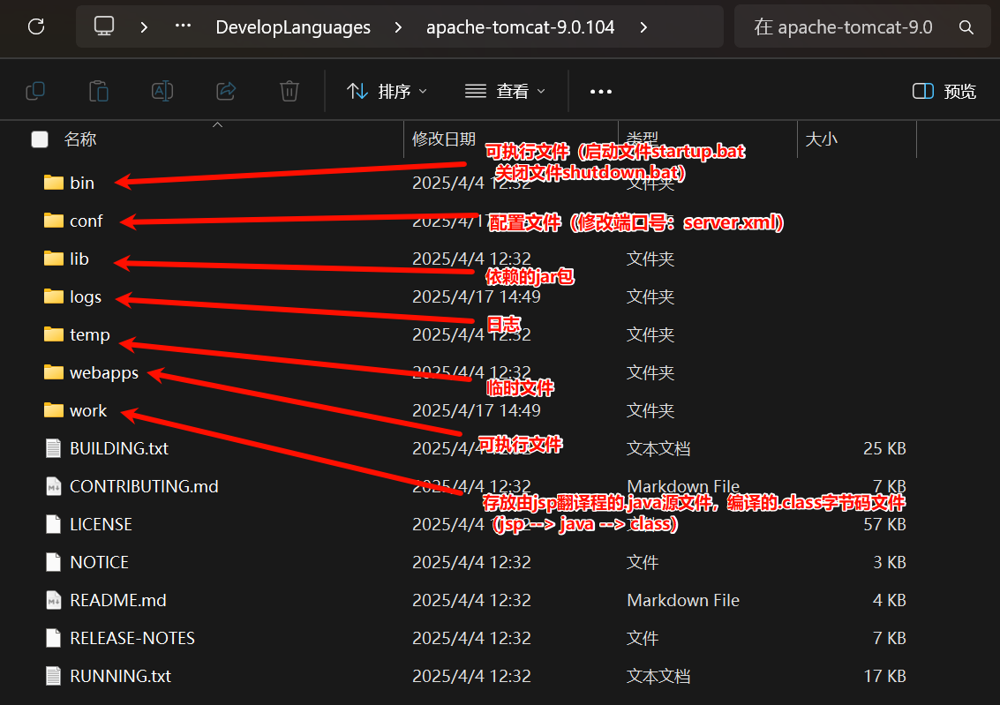

# JavaWeb

## 1、基本概念

- 静态web
  - html，css，js（伪动态）
  - 提供给所有人看的数据始终不会发生变化。
- 动态web
  - servlet/jsp，asp，php
  - 提供给所有人看的数据会发生变化，每个人在不同的时间，不同的地点看到的信息不同。


## 2、web应用程序

- 统一的web资源会被放在一个同一文件夹下，web应用程序 ---> Tomcat ：服务器
- 一个web应用程序由多个部分组成（静态web，动态web）
  - html，css，js
  - jsp，servlet
  - java程序
  - jar包
  - 配置文件（Properties）

web应用程序编写完毕后，若想提供给外界访问：需要一个服务器来同一管理。

### 2.1 静态web


缺点：

- web页面无法动态更新，所有用户看到的都是同一个页面
  - 轮播图，点击效果   --->  伪动态
  - JavaScript
- 无法和数据库交互（数据无法持久化，用户无法交互）

### 2.2 动态web


缺点：

- 加入服务器的动态web资源出现错误，需要重新编写**后台程序**，重新发布。
  - 停机维护

优点：

- web页面可以动态更新，所有用户看到的都不是同一个页面
- 可以和数据库交互（数据持久化：注册，商品信息，用户信息...）

### 2.3 技术讲解

1. ASP：
   - 微软推出，在前端代码中嵌入VB脚本：业务逻辑代码：维护成本高
   - C#
   - IIS

2. PHP：
   - 开发速度快，功能强大，跨平台，代码简单
   - 无法承载大访问量（局限性）
3. JSP/Servlet：
   - B/S：浏览和服务器
   - C/S：客户端和服务器
     - sun公司主推的B/S架构
     - 基于java语言
     - 可承载三高问题：高可用、高并发、高性能
     - 语言像ASP， ASP ---> JSP ，加快市场强度

### 2.4 web服务器

**Tomcat 实际上运行JSP页面和Servle**t，具有处理HTML页面的功能，另外它还是一个Servlet和JSP容器，独立的Servlet容器是Tomcat的默认模式。Tomcat最新版本为11.0.0**。**

Tomcat 技术先进、性能稳定，而且免费。


#### Tomcat




## 3、Http

超文本传输协议（Hypertext Transfer Protocol，HTTP）是**一个简单的请求-响应协议**，它通常运行在[TCP](https://baike.baidu.com/item/TCP/33012?fromModule=lemma_inlink)之上。它指定了客户端可能发送给服务器什么样的消息以及得到什么样的响应。请求和响应消息的头以[ASCII](https://baike.baidu.com/item/ASCII/309296?fromModule=lemma_inlink)形式给出；而消息内容则具有一个类似[MIME](https://baike.baidu.com/item/MIME/2900607?fromModule=lemma_inlink)的格式。超文本传输协议是一种用于分布式、协作式和超媒体信息系统的应用层协议，是万维网WWW（World Wide Web）的数据通信的基础。

- 端口：80

### 3.1 两个时代

- Http/1.0：客户端与web服务器连接后，只能获得一个web资源，断开连接。
- Http/1.1：客户端可以与web服务器连接后，可以获得多个web资源。

### 3.2 Http请求

- 客户端 --- 发出请求 --- 服务器

#### 3.2.1 请求行

- 请求行中的请求方式：Get、Post、Head、Delete、Put、Tract...
  - get：请求能够携带的参数比较少，大小有限制，会在浏览器中的**URL地址栏中显示内容**，**不安全，但是高效**
  - post：请求能够携带的参数不受限制，大小无限制，**不会**在浏览器中的URL地址栏中**显示内容****，**安全，但是不高效**

#### 3.2.2 消息头

~~~jajva
Accept：告诉浏览器，它所支持的数据类型
Accept-Encoding：支持哪种编码格式GBK UTF-8 GB2312 IS08859-1
Accept-Language：告诉浏览器，它的语言环境
Cache-Control：缓存控制
connection：告诉浏览器，请求完成是断开还是保持连接
HOST：主机...
~~~


### 3.3 Http响应

- 服务器 --- 响应 --- 客户端

#### 3.3.1 响应体

~~~java
Accept：告诉浏览器，它所支持的数据类型
Accept-Encoding：支持哪种编码格式GBK UTF-8 GB2312 IS08859-1
Accept-Language：告诉浏览器，它的语言环境
Cache-Control：缓存控制
connection：告诉浏览器，请求完成是断开还是保持连接
HOST：主机...
Refresh：告诉客户端，多久刷新一次
Location：让网页重新定位。
~~~

#### 3.3.2 响应状态码

200：请求响应成功     200
3xx：请求重定向

- 重定向：你重新到我给你新位置去；

4xx：找不到资源         404

- 资源不存在；

5xx：服务器代码错误  500    502：网关错误


# 黑马JavaWeb课程

java优点：

- 跨平台
- 安全
- 高效
- api齐全
- 历史悠久


## 1、单元测试 -- JUnit

Junit：最流行的Java测试框架之一，提供一些功能，方便程序进行单元测试（由第三方公司提供）。


### 1.1 常用断言方法

JUnit提供了一些辅助方法，用来帮我们确定被测试的方法是否按照预期的效果正常工作，这种方式称为**断言**。


作用：

- 单元测试方法运行不报错，不代表业务方法没问题；
- 通过断言的方式可以检测运行结果是否和预期结果一致，从而判断业务方法是否正确。


### 1.2 常见注解

一般“@ParameterizedTest”和“@ValueSource”搭配使用，Before一般是初始化工作，After一般是释放资源。


### 1.3 依赖范围


## 2、Maven常见问题解决


## 3、Http请求


## 4、Http响应


## 5、Http状态码


**注意**：响应状态码和响应头如果没有特殊要求，可以不用手动设置，一般服务器会根据请求处理的逻辑，自动设置响应状态码和响应头。


## 6、分层解耦

高耦合低内聚

### 6.1 三层架构


**好处**：

- 复用性强
- 方便维护


### 6.2 分层解耦


在bean中的对象名称默认为 对象首字符小写，后面字符不。


#### 6.2.1 IOC控制反转


**注意**：

- 在Springboot继承web开发中，声明控制器bean只能用@Controller。
- 声明bean的注解要想生效，需要被扫描到，启动类默认扫描当钱包及其子包。


#### 6.2.2 DI依赖注入


spring官方推荐构造函数注入方式，但是许多企业都运用的是属性注入方式。


**注意**：

- @Resource 与 @Autowired 的区别
  - @Autowired是spring框架提供的注解，而@Resource是JavaEE规范提供的
  - **@Autowired**默认是按照**类型**注入，而**@Resource**默认是按照**名称**注入


## 7、MySQL


### 7.1 DDL

- Data Definition Language，数据定义语言，**用来定义数据库对象**（**数据库，表，字段**）


默认utf8md4，功能强大，比较通用。


#### 7.1.1 表结构-创建：


需要主键自增用关键字 auto_increment


#### 7.1.2 数值类型：


#### 7.1.3 字符串类型：


#### 7.1.4 日期时间类型：


#### 7.1.5 表设计：

基础字段：id、create_time、update_time


#### 7.1.6 表查询、修改、删除：


### 7.2 DML

- DML全称是Data Manipulation Languoge(数据操作语言)，用**来对数据库中表的数据记录进行增、删、改操作**。


- 添加数据 ==INSERT==
- 修改数据 ==UPDATE==
- 删除数据 ==DELETE==

#### 7.2.1 INSERT


**注意**：

- 插入数据时，指定的字段顺序需要与值的顺序一一对应。
- **字符串和日期类型应该包含在引号中**（单引号、双引号都可以）。
- 插入的数据大小/长度，应该在字段的规定范围内。
- 添加日期时，可以利用 **new()** 函数进行添加当前时间。


#### 7.2.2 UPDATE


**注意**：

- 修改语句的条件可以有，也可以没有，**如果没有条件，则会修改整张表的所有数据。**


#### 7.2.3 DELETE


**注意**：

- DELETE语句的条件可以有，也可以没有，**如果没有条件，则会删除整张表的所有数据。**
- **DELETE语句不能删除某一个字段的值**（如果要操作，可以使用UPDATE，将该字段的值设置为NULL）。


### 7.3 DQL

- Data Query Language(数据查询语句)，用来查询数据库表中的数据。


#### 7.3.1 基本查询


**注意**：

- 当起别名的时候（as 别名1），最好加上 ' ' 单引号，防止中间出现空格或者其他符号影响别名设置。 as 可以省略。
- \* 号代表查询所有字段，在实际开发中尽量少用（不直观，影响效率）。


#### 7.3.2 条件查询


#### 7.3.3 分组查询

- ==聚合函数==：将一列数据作为一个整体，进行纵向计算。


~~~mysql
-- 1.统计该企业员工数量－count
-- count（字段）
select count(id）from emp;
             
-- count（*）：推荐  底层做了优化
select count(*)from emp;
             
-- count（常量）：推荐
select count(1） from emp;
~~~

**注意**：

- **null值不参与所有聚合函数的计算**
- 统计数量可以使用：count(\*)  count(字段)  count(常量)，推荐使用count(\*)


- where与having的区别:
  1. **执行时机不同**：where是分组之前进行过滤，不满足where条件，不参与分组；而having是分组之后对结果进行过滤。
  2. **判断条件不同**：**where不能对聚合函数进行判断，而having可以。**

**注意**：

- **分组之后，查询的字段一般为==聚合函数==和==分组字段==**，查询其他字段无任何意义。
- **执行顺序： where > 聚合函数 > having 。**


#### 7.3.4 排序查询


- 排序方式：升序(asc)(默认)，降序(desc)；**默认为升序asc，可以不写。**

**注意**：

- 如果是多字段排序， 当第一个字段值相同时，才会根据第二个字段进行排序。


#### 7.3.5 分页查询


**注意**：

- 起始索引从0开始。
- 分页查询是数据库的方言，**不同的数据库有不同的实现**，**MySQL中时LIMIT**。
- **如果起始索引为0，起始索引可以省略**，直接简写为 limit 10.


## 8、JDBC

- Java FataBase Connectivity，使用Java语言操作关系型数据库的一套API。


- 本质：

  - sun公司官方定义的一套操作所有关系型数据库的规范，即接口。
  - 各个数据库厂商去实现这套接口，提供数据库驱动jar包
  - 可以使用这套接口（JDBC）编程，真正执行的代码是驱动jar包中的实现类。

  

### 8.1 JDBC - 修改

```java
// 1. 注册驱动 -> 导入驱动包
Class.forName("com.mysql.cj.jdbc.Driver");

// 2. 连接数据库
String url = "jdbc:mysql://localhost:3306/web01";
String user = "root";
String password = "1234";
Connection connection = DriverManager.getConnection(url, user, password);

// 3. 获取sql操作对象
Statement statement = connection.createStatement();

// 4. 操作sql
int i = statement.executeUpdate("update user set age = 25 where id = 1"); // DML
System.out.println("影响数据数量：" + i);

// 5. 释放资源
statement.close();
connection.close();
```

 

### 8.2 JDBC - 查询


```java
// 数据库连接信息
String URL = "jdbc:mysql://localhost:3306/web01";
String USER = "root";
String PASSWORD = "1234";
// 查询语句
String sql = "SELECT id, username, password, name, age FROM user WHERE username = ? AND password = ?"; // 预编译SQL
// 创建 User 对象的列表
try (
        Connection connection = DriverManager.getConnection(URL, USER, PASSWORD);
        PreparedStatement preparedStatement = connection.prepareStatement(sql)
            ) {
    // 设置查询参数
    preparedStatement.setString(1, "daqiao");
    preparedStatement.setString(2, "123456");

    // 执行查询
    ResultSet resultSet = preparedStatement.executeQuery();

    // 遍历结果集
    while (resultSet.next()) {
        // 封装到 User 对象
        User user = new User(
                resultSet.getInt("id"),
                resultSet.getString("username"),
                resultSet.getString("password"),
                resultSet.getString("name"),
                resultSet.getInt("age")
        );
        // 输出 User 对象
        System.out.println(user);
    }
} catch (SQLException e) {
    e.printStackTrace();
}
```


注意：

1. JDBC执行语句
   - DML语句：int rowsAffected = statement.executeUpdate();
   - DQL语句: ResultSet rs = statement.executeQuery();
2. DQL语句执行完毕结果集ResultSet解析
   - resultSet.next()：光标往下移动一行
   - resultSet.getXxx()：获取字段数据


### 8.3 预编译SQL

**优势**：

- **防止SQL注入，更安全**

  SQL注入：通过控制输入来修改事先定义好的SQL语句，以达到执行代码对服务器进行攻击的方法。

  

- **性能更高**

  


​		通过调用connection.prepareStatement(nt("SELECT * FROM user WHERE username = ? AND password = ?"); 来进行预编译，然后通过 prepareStatement.setString(第几个？位置 int类型, 字符串的信息 String)来替换？进行查询。


## 9、MyBatis

- MyBatis是一款优秀的**持久层**框架，用于**简化JDBC**的开发。
- MyBatis本是Apache的一个开源项目iBatis，2010年这个项目由apache迁移到了googlecode，并且改名为MyBatis。2013年11月迁移到Github。

### 9.1 入门配置

- 操作步骤：

  - 准备工作

    - A. 创建springboot工程，引入Mybatis相关依赖

      

      

    - B. 准备数据库表、实体类

    - C. application.properties中配置数据库连接信息

      ```properties
      #数据库访问的url地址
      spring.datasource.url=jdbc:mysql://localhost:3306/web01
      #数据库驱动类类名
      spring.datasource.driver-class-name=com.mysql.cj.jdbc.Driver
      #访问数据库-用户名
      spring.datasource.username=root
      #访问数据库-密码
      spring.datasource.password=1234
      ```

  - 定义Mapper接口（==@Mapper==：表示是mybatis中的Mapper接口程序运行时，**框架会自动生成接口的实现类对象(代理对象)**，**并给交Spring的IOC容器管理**），编写SQL

    

- 单元测试类上的注解
  - @SpringBootTest：会在单元测试运行时，加载springBoot的环境
  - **注意：测试类所在包需要与引导类包名相同（或放在引导类所在包的子包下）**


