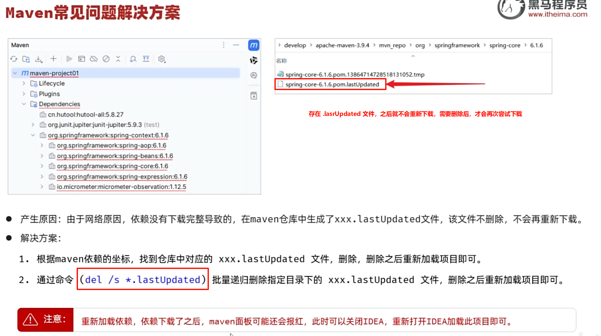
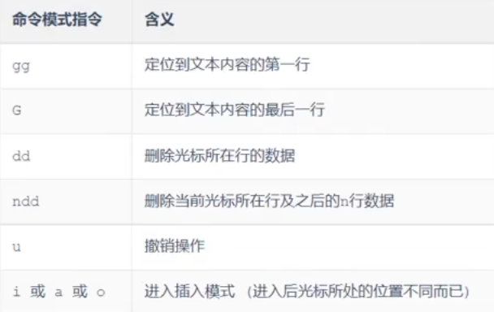

# JavaWeb

## 1、基本概念

- 静态web
  - html，css，js（伪动态）
  - 提供给所有人看的数据始终不会发生变化。
- 动态web
  - servlet/jsp，asp，php
  - 提供给所有人看的数据会发生变化，每个人在不同的时间，不同的地点看到的信息不同。


## 2、web应用程序

- 统一的web资源会被放在一个同一文件夹下，web应用程序 ---> Tomcat ：服务器
- 一个web应用程序由多个部分组成（静态web，动态web）
  - html，css，js
  - jsp，servlet
  - java程序
  - jar包
  - 配置文件（Properties）

web应用程序编写完毕后，若想提供给外界访问：需要一个服务器来同一管理。

### 2.1 静态web


缺点：

- web页面无法动态更新，所有用户看到的都是同一个页面
  - 轮播图，点击效果   --->  伪动态
  - JavaScript
- 无法和数据库交互（数据无法持久化，用户无法交互）

### 2.2 动态web


缺点：

- 加入服务器的动态web资源出现错误，需要重新编写**后台程序**，重新发布。
  - 停机维护

优点：

- web页面可以动态更新，所有用户看到的都不是同一个页面
- 可以和数据库交互（数据持久化：注册，商品信息，用户信息...）

### 2.3 技术讲解

1. ASP：
   - 微软推出，在前端代码中嵌入VB脚本：业务逻辑代码：维护成本高
   - C#
   - IIS

2. PHP：
   - 开发速度快，功能强大，跨平台，代码简单
   - 无法承载大访问量（局限性）
3. JSP/Servlet：
   - B/S：浏览和服务器
   - C/S：客户端和服务器
     - sun公司主推的B/S架构
     - 基于java语言
     - 可承载三高问题：高可用、高并发、高性能
     - 语言像ASP， ASP ---> JSP ，加快市场强度

### 2.4 web服务器

**Tomcat 实际上运行JSP页面和Servle**t，具有处理HTML页面的功能，另外它还是一个Servlet和JSP容器，独立的Servlet容器是Tomcat的默认模式。Tomcat最新版本为11.0.0**。**

Tomcat 技术先进、性能稳定，而且免费。


#### Tomcat


## 3、Http

超文本传输协议（Hypertext Transfer Protocol，HTTP）是**一个简单的请求-响应协议**，它通常运行在[TCP](https://baike.baidu.com/item/TCP/33012?fromModule=lemma_inlink)之上。它指定了客户端可能发送给服务器什么样的消息以及得到什么样的响应。请求和响应消息的头以[ASCII](https://baike.baidu.com/item/ASCII/309296?fromModule=lemma_inlink)形式给出；而消息内容则具有一个类似[MIME](https://baike.baidu.com/item/MIME/2900607?fromModule=lemma_inlink)的格式。超文本传输协议是一种用于分布式、协作式和超媒体信息系统的应用层协议，是万维网WWW（World Wide Web）的数据通信的基础。

- 端口：80

### 3.1 两个时代

- Http/1.0：客户端与web服务器连接后，只能获得一个web资源，断开连接。
- Http/1.1：客户端可以与web服务器连接后，可以获得多个web资源。

### 3.2 Http请求

- 客户端 --- 发出请求 --- 服务器

#### 3.2.1 请求行

- 请求行中的请求方式：Get、Post、Head、Delete、Put、Tract...
  - get：请求能够携带的参数比较少，大小有限制，会在浏览器中的**URL地址栏中显示内容**，**不安全，但是高效**
  - post：请求能够携带的参数不受限制，大小无限制，**不会**在浏览器中的URL地址栏中**显示内容****，**安全，但是不高效**

#### 3.2.2 消息头

~~~jajva
Accept：告诉浏览器，它所支持的数据类型
Accept-Encoding：支持哪种编码格式GBK UTF-8 GB2312 IS08859-1
Accept-Language：告诉浏览器，它的语言环境
Cache-Control：缓存控制
connection：告诉浏览器，请求完成是断开还是保持连接
HOST：主机...
~~~


### 3.3 Http响应

- 服务器 --- 响应 --- 客户端

#### 3.3.1 响应体

~~~java
Accept：告诉浏览器，它所支持的数据类型
Accept-Encoding：支持哪种编码格式GBK UTF-8 GB2312 IS08859-1
Accept-Language：告诉浏览器，它的语言环境
Cache-Control：缓存控制
connection：告诉浏览器，请求完成是断开还是保持连接
HOST：主机...
Refresh：告诉客户端，多久刷新一次
Location：让网页重新定位。
~~~

#### 3.3.2 响应状态码

200：请求响应成功     200
3xx：请求重定向

- 重定向：你重新到我给你新位置去；

4xx：找不到资源         404

- 资源不存在；

5xx：服务器代码错误  500    502：网关错误


# 黑马JavaWeb课程

java优点：

- 跨平台
- 安全
- 高效
- api齐全
- 历史悠久


## 1、单元测试 -- JUnit

Junit：最流行的Java测试框架之一，提供一些功能，方便程序进行单元测试（由第三方公司提供）。


### 1.1 常用断言方法

JUnit提供了一些辅助方法，用来帮我们确定被测试的方法是否按照预期的效果正常工作，这种方式称为**断言**。


作用：

- 单元测试方法运行不报错，不代表业务方法没问题；
- 通过断言的方式可以检测运行结果是否和预期结果一致，从而判断业务方法是否正确。


### 1.2 常见注解

一般“@ParameterizedTest”和“@ValueSource”搭配使用，Before一般是初始化工作，After一般是释放资源。


### 1.3 依赖范围


## 2、Maven常见问题解决




## 3、Http请求


## 4、Http响应


## 5、Http状态码


**注意**：响应状态码和响应头如果没有特殊要求，可以不用手动设置，一般服务器会根据请求处理的逻辑，自动设置响应状态码和响应头。


## 6、分层解耦

高耦合低内聚

### 6.1 三层架构


**好处**：

- 复用性强
- 方便维护


### 6.2 分层解耦


在bean中的对象名称默认为 对象首字符小写，后面字符不。


#### 6.2.1 IOC控制反转


**注意**：

- 在Springboot继承web开发中，声明控制器bean只能用@Controller。
- 声明bean的注解要想生效，需要被扫描到，启动类默认扫描当前包及其子包。


#### 6.2.2 DI依赖注入


spring官方推荐构造函数注入方式，但是许多企业都运用的是属性注入方式。


**注意**：

- @Resource 与 @Autowired 的区别
  - @Autowired是spring框架提供的注解，而@Resource是JavaEE规范提供的
  - **@Autowired**默认是按照**类型**注入，而**@Resource**默认是按照**名称**注入


## 7、MySQL


### 7.1 DDL

- Data Definition Language，数据定义语言，**用来定义数据库对象**（**数据库，表，字段**）


默认utf8md4，功能强大，比较通用。


#### 7.1.1 表结构-创建：


需要主键自增用关键字 auto_increment


#### 7.1.2 数值类型：


#### 7.1.3 字符串类型：


#### 7.1.4 日期时间类型：


#### 7.1.5 表设计：

基础字段：id、create_time、update_time


#### 7.1.6 表查询、修改、删除：


### 7.2 DML

- DML全称是Data Manipulation Languoge(数据操作语言)，用**来对数据库中表的数据记录进行增、删、改操作**。


- 添加数据 ==INSERT==
- 修改数据 ==UPDATE==
- 删除数据 ==DELETE==

#### 7.2.1 INSERT


**注意**：

- 插入数据时，指定的字段顺序需要与值的顺序一一对应。
- **字符串和日期类型应该包含在引号中**（单引号、双引号都可以）。
- 插入的数据大小/长度，应该在字段的规定范围内。
- 添加日期时，可以利用 **new()** 函数进行添加当前时间。


#### 7.2.2 UPDATE


**注意**：

- 修改语句的条件可以有，也可以没有，**如果没有条件，则会修改整张表的所有数据。**


#### 7.2.3 DELETE


**注意**：

- DELETE语句的条件可以有，也可以没有，**如果没有条件，则会删除整张表的所有数据。**
- **DELETE语句不能删除某一个字段的值**（如果要操作，可以使用UPDATE，将该字段的值设置为NULL）。


### 7.3 DQL

- Data Query Language(数据查询语句)，用来查询数据库表中的数据。


#### 7.3.1 基本查询


**注意**：

- 当起别名的时候（as 别名1），最好加上 ' ' 单引号，防止中间出现空格或者其他符号影响别名设置。 as 可以省略。
- \* 号代表查询所有字段，在实际开发中尽量少用（不直观，影响效率）。


#### 7.3.2 条件查询


#### 7.3.3 分组查询

- ==聚合函数==：将一列数据作为一个整体，进行纵向计算。


~~~mysql
-- 1.统计该企业员工数量－count
-- count（字段）
select count(id）from emp;
             
-- count（*）：推荐  底层做了优化
select count(*)from emp;
             
-- count（常量）：推荐
select count(1） from emp;
~~~

**注意**：

- **null值不参与所有聚合函数的计算**
- 统计数量可以使用：count(\*)  count(字段)  count(常量)，推荐使用count(\*)


- where与having的区别:
  1. **执行时机不同**：where是分组之前进行过滤，不满足where条件，不参与分组；而having是分组之后对结果进行过滤。
  2. **判断条件不同**：**where不能对聚合函数进行判断，而having可以。**

**注意**：

- **分组之后，查询的字段一般为==聚合函数==和==分组字段==**，查询其他字段无任何意义。
- **执行顺序： where > 聚合函数 > having 。**


#### 7.3.4 排序查询


- 排序方式：升序(asc)(默认)，降序(desc)；**默认为升序asc，可以不写。**

**注意**：

- 如果是多字段排序， 当第一个字段值相同时，才会根据第二个字段进行排序。


#### 7.3.5 分页查询


**注意**：

- 起始索引从0开始。
- 分页查询是数据库的方言，**不同的数据库有不同的实现**，**MySQL中时LIMIT**。
- **如果起始索引为0，起始索引可以省略**，直接简写为 limit 10.


## 8、JDBC

- Java FataBase Connectivity，使用Java语言操作关系型数据库的一套API。


- 本质：

  - sun公司官方定义的一套操作所有关系型数据库的规范，即接口。
  - 各个数据库厂商去实现这套接口，提供数据库驱动jar包
  - 可以使用这套接口（JDBC）编程，真正执行的代码是驱动jar包中的实现类。

  

### 8.1 JDBC - 修改

```java
// 1. 注册驱动 -> 导入驱动包
Class.forName("com.mysql.cj.jdbc.Driver");

// 2. 连接数据库
String url = "jdbc:mysql://localhost:3306/web01";
String user = "root";
String password = "1234";
Connection connection = DriverManager.getConnection(url, user, password);

// 3. 获取sql操作对象
Statement statement = connection.createStatement();

// 4. 操作sql
int i = statement.executeUpdate("update user set age = 25 where id = 1"); // DML
System.out.println("影响数据数量：" + i);

// 5. 释放资源
statement.close();
connection.close();
```

 

### 8.2 JDBC - 查询


```java
// 数据库连接信息
String URL = "jdbc:mysql://localhost:3306/web01";
String USER = "root";
String PASSWORD = "1234";
// 查询语句
String sql = "SELECT id, username, password, name, age FROM user WHERE username = ? AND password = ?"; // 预编译SQL
// 创建 User 对象的列表
try (
        Connection connection = DriverManager.getConnection(URL, USER, PASSWORD);
        PreparedStatement preparedStatement = connection.prepareStatement(sql)
            ) {
    // 设置查询参数
    preparedStatement.setString(1, "daqiao");
    preparedStatement.setString(2, "123456");

    // 执行查询
    ResultSet resultSet = preparedStatement.executeQuery();

    // 遍历结果集
    while (resultSet.next()) {
        // 封装到 User 对象
        User user = new User(
                resultSet.getInt("id"),
                resultSet.getString("username"),
                resultSet.getString("password"),
                resultSet.getString("name"),
                resultSet.getInt("age")
        );
        // 输出 User 对象
        System.out.println(user);
    }
} catch (SQLException e) {
    e.printStackTrace();
}
```


注意：

1. JDBC执行语句
   - DML语句：int rowsAffected = statement.executeUpdate();
   - DQL语句: ResultSet rs = statement.executeQuery();
2. DQL语句执行完毕结果集ResultSet解析
   - resultSet.next()：光标往下移动一行
   - resultSet.getXxx()：获取字段数据


### 8.3 预编译SQL

**优势**：

- **防止SQL注入，更安全**

  SQL注入：通过控制输入来修改事先定义好的SQL语句，以达到执行代码对服务器进行攻击的方法。

  

- **性能更高**

  


​		通过调用connection.prepareStatement(nt("SELECT * FROM user WHERE username = ? AND password = ?"); 来进行预编译，然后通过 prepareStatement.setString(第几个？位置 int类型, 字符串的信息 String)来替换？进行查询。


## 9、MyBatis

- MyBatis是一款优秀的**持久层**框架，用于**简化JDBC**的开发。
- MyBatis本是Apache的一个开源项目iBatis，2010年这个项目由apache迁移到了googlecode，并且改名为MyBatis。2013年11月迁移到Github。

### 9.1 入门配置

- 操作步骤：

  - 准备工作

    - A. 创建springboot工程，引入Mybatis相关依赖

      

      

    - B. 准备数据库表、实体类

    - C. application.properties中配置数据库连接信息

      ```properties
      #数据库访问的url地址
      spring.datasource.url=jdbc:mysql://localhost:3306/web01
      #数据库驱动类类名
      spring.datasource.driver-class-name=com.mysql.cj.jdbc.Driver
      #访问数据库-用户名
      spring.datasource.username=root
      #访问数据库-密码
      spring.datasource.password=1234
      ```

  - 定义Mapper接口（==@Mapper==：表示是mybatis中的Mapper接口程序运行时，**框架会自动生成接口的实现类对象(代理对象)**，**并给交Spring的IOC容器管理**），编写SQL

    

- 单元测试类上的注解
  - @SpringBootTest：会在单元测试运行时，加载springBoot的环境
  - **注意：测试类所在包需要与引导类包名相同（或放在引导类所在包的子包下）**


### 9.2 数据库连接池

- **数据库连接池**是个**容器**，负责分配、管理数据库连接（Connection）。

- 允许应用程序重复使用一个现有的数据库连接，而不是再重新建立一个。

- **释放**空闲时间超过最大空闲时间的连接，来**避免**因为没有释放连接而引起的**数据库连接遗漏**。

  

- **优势**：
  - 资源复用
  - 提升系统响应速度
  - 避免数据库连接遗落


- 标准接口：**DataSource**
  - 官方(sun)提供的数据库连接池接口，由第三方组织实现此接口。
  - 功能：获取连接 `Connection getConnection() throws SQLException`


### 9.3 删除用户 -- @Delete


**注意**：

- **\# 是占位符，会替换为 ？ 生成预编译SQL** （推荐）
- $ 是字符串拼接符号，将参数值直接拼接在SQL中。


### 9.4 新增用户 -- @Insert


### 9.5 更新用户 -- @Update


### 9.6 查询用户 -- @Select


当基于官方的springboot项目骨架的时候，是可以省略@Param注解的，因为在官方的父工程中有maven编译的插件，对parameter进行保留。


###  9.7 XML映射配置


==**注意**==：当使用**简单的增删改查的时候直接用Mybatis注解**就行，如果要**实现复杂的SQL功能，使用XML**来配置映射语句。


如果想自己在resources目录下创建专门的mapper xml映射位置，可以在配置文件中配置mapper路径


java和resources目录下的文件会统一编译到classes字节码文件下，如果指定了mapper路径，则会直接在指定路径下去找对于Mapper.xml文件；如果没有指定，则必须要求resources目录下的文件路径与Mapper.java文件路径相同，代表编译为字节码文件后，xml和java在同一包内，否则找不到。


## 10、SpringBoot项目配置文件说明


### 10.1 yml配置文件

- 格式：
  - 数值前边必须有空格，作为分隔符
  - 使用缩进表示层级关系，缩进时，不允许使用Tab键，只能用空格（idea中会自动将Tab转换为空格）
  - 缩进的空格数目不重要，只要相同层级的元素左侧对齐即可
  - \# 表示注释，从这个字符一直到行尾，都会被解析器忽略


- 定义对象/Map集合


- 定义数组/List/Set集合


==**注意**==：

- **在yml格式的配置文件中，如果配置项的值是以 0 开头的，值需要使用 ' ' 单引号阔起来，因为以0开头在yml中表示8进制的数据。**


## 11、项目准备工作

### 11.1 开发规范

- 开发模式：


根据页面原型和需要进行分析和设计处接口文档


- 开发规范：Restful规范
  - RESR（==RE==presentational ==S==tate ==T==ransfer），**表述性**状态转换，是一种软件架构风格。


**注意**：

- REST是风格，是约定方式，约定不是规定，可以打破。
- 描述功能模块通常使用复数形式（**加s**），表示**此类资源，而非单个资源**。如：users、books...


### 11.2 工程搭建

1. 建SpringBoot工程，并引l入web开发起步依赖、mybatis、mysql驱动、lombok。**查看project structure中的sdk和panguage level版本，editor中的file encoding中global encoding、project encoding和default encoding for properties files都调整为utf-8，maven仓库地址是否正确**。
2. 创建数据库表dept，并在application.yml中配置数据库的基本信息。
3. 准备基础代码结构，并引l入实体类Dept及统一的**响应结果封装类Result**。


## 12、前后端联桥


## 13、部门管理

### 13.1 列表查询


​		由于java中实体属性是驼峰命名规则，而sql中的命名规则是加下划线 ‘_’ ，因此需要进行加工才能使得相关属性的值传输成功。	


### 13.2 406 问题解决方案

#### 13.2.1 方法一 -- 删除插件


#### 13.2.2 方法二 -- 指定版本


### 13.3 删除部门

- 方式一：通过原始的==HttpServletRequest==对象获取

  ~~~java
  String xxx = request.getParameter("xxx");
  ~~~

- 方式二：通过==@RequestParam==注解进行参数绑定

  ~~~java
  public Result del(@RequestParam("id")Integer deptId){}
  ~~~

  

  当使用注解的时候，再@RequestParam注解中有参数required默认为true，意思是必须有参数传递，不然会报错。如果想要不传递参数也请求成功的话，可以将requied设置为false。

- 方式三：**保证请求参数名与形参变量名相同，直接接收（推荐）**

  ~~~java
  // http://localhost:8080/depts?id=1
  public Result del(Integer id){}
  ~~~


### 13.4 新增部门


@RequestBody 形参里面的属性必须有与post请求体中相同名字的键名。


### 13.5 修改部门

@PathVariable

- 查询回显

  

  


- 修改数据

  

## 14、日志技术


- JUL：这是JaVaSE平台提供的官方日志框架，也被称为JUL。配置相对简单，但不够灵活，性能较差。
- Log4j：一个流行的日志框架，提供了灵活的配置选项，支持多种输出目标。
- Logback：基于Log4j升级而来，提供了更多的功能和配置选项，性能优于Log4j。
- Slf4j（Simple Logging Facade for Java）：简单日志门面，提供了一套日志操作的标准接口及抽象类，允许应用程序使用不同的底层日志框架。


### 14.1 logback.xml

~~~xml
<?xml version="1.0" encoding="UTF-8"?>
<configuration>
    <!-- 控制台输出 -->
    <appender name="STDOUT" class="ch.qos.logback.core.ConsoleAppender">
        <encoder class="ch.qos.logback.classic.encoder.PatternLayoutEncoder">
            <!--格式化输出：%d 表示日期，%thread 表示线程名，%-5level表示级别从左显示5个字符宽度，%logger显示日志记录器的名称， %msg表示日志消息，%n表示换行符 -->
            <pattern>%d{yyyy-MM-dd HH:mm:ss.SSS} [%thread] %-5level %logger{50} - %msg%n</pattern>
        </encoder>
    </appender>
 
    <!-- 系统文件输出 -->
    <appender name="FILE" class="ch.qos.logback.core.rolling.RollingFileAppender">
        <rollingPolicy class="ch.qos.logback.core.rolling.SizeAndTimeBasedRollingPolicy">
            <!-- 日志文件输出的绝对路径和文件名, %i表示序号 -->
            <FileNamePattern>D:/tlias-%d{yyyy-MM-dd}-%i.log</FileNamePattern>
            <!-- 最多保留的历史日志文件数量 -->
            <MaxHistory>30</MaxHistory>
            <!-- 最大文件大小，超过这个大小会触发滚动到新文件，默认为 10MB -->
            <maxFileSize>10MB</maxFileSize>
        </rollingPolicy>
 
        <encoder class="ch.qos.logback.classic.encoder.PatternLayoutEncoder">
            <!--格式化输出：%d 表示日期，%thread 表示线程名，%-5level表示级别从左显示5个字符宽度，%msg表示日志消息，%n表示换行符 -->
            <pattern>%d{yyyy-MM-dd HH:mm:ss.SSS} [%thread] %-5level %logger{50} - %msg%n</pattern>
        </encoder>
    </appender>
 
    <!-- 日志输出级别 -->
    <!-- all：开启  off：关闭 -- 这里也可以设置日志级别，级别由低到高：trance < debug < info < warn < error -->
    <root level="ALL"> 
        <appender-ref ref="STDOUT" />
        <appender-ref ref="FILE" />
    </root>
</configuration>
~~~


### 14.2 logger声明

用sl4j库中的，面向接口编程

```java
private static final Logger logger = LoggerFactory.getLogger(LogTest.class);
```


### 14.3 日志级别

- 指的是日志信息的类型，日志会分级别，常见的日志级别如下（**级别由低到高**）：


- **常用日志和使用场景**：

  - **debug**：记录程序的调试信息

  - **info**：记录正常系统运行日志，重要信息

  - **error**：记录错误异常信息


## 15、多表关系

### 15.1 外键约束 -- 物理外键 foreign key

使用 foreign key 定义外键关联另一张表。


**作用**：

- 多表操作中保证数据的**一致性、完整性和正确性**

**缺点**：

- 影响增、删、改的效率（需要检查外键关系）。
- 仅用于单节点数据库，不适用与分布式、集群场景。
- 容易引发数据库的死锁问题，消耗性能。


**逻辑外键**：

- 概念：**在==业务层逻辑==中，解决外键关联。**
- 通过逻辑外键，可以很方便的解决上述问题。


## 16、员工管理

#### 16.1 分页查询

##### 16.1.1 原始方法

@RequestParam(defaultValue = "")


##### 16.1.2 借助PageHelper进行分页查询

- PageHelper是第三方提供的在Mybatis框架中用来实现分页的插件，用来**简化分页操作**，**提高开发效率**。


- **使用步骤**
  1. 引入PageHelper的依赖
  2. 定义Mapper接口的查询方法**（无需考虑分页）**
  3. 在Service方法中实现分页查询


##### 16.1.3 MyBatis中动态SQL查询

- \<if>标签：条件判断，如果条件成立，则拼接对应的sql片段N
- \<where>标签：根据查询条件，来生成where关键字，并会自动去除条件前面
  多余的and或or。


#### 16.2  新增员工


- 批量添加员工信息 - \<foreach>


## 17、事务管理

- 事务是一组操作的集合，是一个不可分割的工作单位。这组操作要么全部成功，要么全部失败。

控制事务：

- 开启事务：start transaction/begin
- 提交事务：commit
- 回滚事务：rollback

场景：

- 银行转账
  - 下单扣减库存


#### 17.1 spring事务管理 - 控制事务

- 注解：@Transactional  ==默认出现RuntimeException 才会回滚==
- 作用：将当前方法交给spring进行事务管理，方法执行前，开启事务；成功执行完毕，提交事务；出现异常，回滚事务
- 位置：业务（service）层的方法上、类上、接口上，**推荐添加到方法上**


- 配置管理日志级别

  ~~~yml
  # 配置事务管理日志级别
  logging:
    level:
      org.springframework.jdbc.support.JdbcTransactionManager: debug
  ~~~

- 在@Transaction中的属性：

  - rollbackFor = {Exception.class}  指定什么异常会进行回滚
  - propagation 事务的传播行为 

  

- 事务的四大特性（ACID）：原子性、一致性、隔离性、持久性

  


## 18、文件上传

- 前端和后端代码示例：


- 如果将前端的 `enctype="multipart/form-data"`删除，那么则只能上传文件名，而不能上传文件中的内容
- 上传的文件内容是二进制数据。


- multipartFile.getOriginalFilename()：获取原始文件名
- multipartFile.transferTo(File dest)：将文件转存到磁盘文件


- 在spring中的默认单个文件最大为1m，所有文件和表单数据最大为10m，因此我们可以在配置文件中进行更改设置

  ~~~yml
  spring:
    servlet:
      multipart:
        # 最大单个文件大小
        max-file-size: 10MB
        # 最大请求大小（包括所有文件和表单数据）
        max-request-size: 100MB
  ~~~


- 灵活配置参数：然后利用springboot包下的@Value来指定参数


- 通过@ConfigurationProperties来注入到实体类中


- 使用建议：
  - 如果配置属性少，就用@Value
  - 如果配置属性多，就用@ConfigurationProperties


## 19、全局异常处理器

@RestControllerAdvice = @ControllerAdvice + @ResponseBody

```java
@Slf4j
@RestControllerAdvice
public class GlobalExceptionHandler {

    @ExceptionHandler
    public Result handlerException(Exception e) {
        log.error("程序出错了：", e);
        return Result.error("出错啦，请联系管理员~    ");
    }

    public Result handlerDuplicateKeyException(DuplicateKeyException e) {
        log.error("程序出错了：", e);
        String message = e.getMessage();
        int i = message.indexOf("Duplicate entry");
        String errMsg = message.substring(i);
        String[] arr = errMsg.split(" ");
        return Result.error(arr[2] + " 已存在");
    }
}
```


## 20、员工数据统计

- 职位统计


## 21、登录认证

### 21.1 会话技术

- 会话：打开浏览器，访问web服务器的资源，会话建立，直到有一方断开连接，会话结束。在一次会话中可以包含多次请求和响应。
- 会话跟踪：一种维护浏览器状态的方法，服务器需要识别多次请求是否来自于同一浏览器，以便在同一次会话的多次请求间共享数据。
- 会话跟踪方案：
  - 客户端会话跟踪技术：Cookie
  - 服务端会话跟踪技术：Session
  - 令牌技术


#### 21.1.1 Cookie

存放在浏览器中


- 优点：HTTP协议中支持的技术

- 缺点：
  - 移动端APP无法使用Cookie
  - 不安全，用户可以自己禁用Cookie
  - Cookie不能跨域


~~~java
@Slf4j
@RestController
public class CookieController {

    //设置Cookie
    @GetMapping("/c1")
    public Result cookie1(HttpServletResponse response){
        response.addCookie(new Cookie("login_username","itheima")); //设置Cookie/响应Cookie
        return Result.success();
    }
        
    //获取Cookie
    @GetMapping("/c2")
    public Result cookie2(HttpServletRequest request){
        Cookie[] cookies = request.getCookies();
        for (Cookie cookie : cookies) {
            if(cookie.getName().equals("login_username")){
                System.out.println("login_username: "+cookie.getValue()); //输出name为login_username的cookie
            }
        }
        return Result.success();
    }
}    
~~~


#### 21.1.2 Session

存放在服务器中 - 安全，底层是Cookie


- 优点：存储在服务端，安全
- 缺点：
  - 服务器集群环境下无法直接使用Session
  - Cookie中的所有缺点（Session底层实现是Cookie）
    - 移动端APP无法使用Cookie
    - 用户可以直接禁用Cookie，不安全
    - Cookie不能跨域


~~~java
@Slf4j
@RestController
public class SessionController {

    @GetMapping("/s1")
    public Result session1(HttpSession session){
        log.info("HttpSession-s1: {}", session.hashCode());

        session.setAttribute("loginUser", "tom"); //往session中存储数据
        return Result.success();
    }

    @GetMapping("/s2")
    public Result session2(HttpServletRequest request){
        HttpSession session = request.getSession();
        log.info("HttpSession-s2: {}", session.hashCode());

        Object loginUser = session.getAttribute("loginUser"); //从session中获取数据
        log.info("loginUser: {}", loginUser);
        return Result.success(loginUser);
    }
}
~~~


#### 21.1.3 令牌 - 主流方案


- **优点**：

  - 支持PC端、移动端、小程序端

  - 解决集群环境下的认证问题

  - **减轻服务器端存储压力**

- 缺点：需要自己实现


### 21.2 JWT令牌

- 全称：JSON Web Token(https://jwt.io/)
- 定义了一种简洁的、自包含的格式，用于在通信双方以json数据格式安全的传输信息。
- 组成：
  - 第一部分：Header（头），记录令牌类型、签名算法等。例如：{"alg":"HS256"，"type":"JWT"}
  - 第二部分：Payload（有效载荷），携带一些自定义信息、默认信息等。例如：{"id":"1"，"username":"Tom"}
  - 第三部分：Signature（签名），防止Token被篡改、确保安全性。将header、payload融入，并加入指定秘钥，通过指定签名算法计算而来。


Base64：一种基于64个可打印字符（A-Z a-Z 0-9 + /）来表示二进制数据的编码方式。


生成和校验：Jwts.builder()...  Jwts.parser()...


**报错情况**：JWT令牌被篡改 或者 过期失效了。

**注意**：

- JWT校验时使用的签名密钥，必须和生成JWT令牌时使用的密钥是配套的。


```Java
package com.itheima.util;

import io.jsonwebtoken.Claims;
import io.jsonwebtoken.Jwts;
import io.jsonwebtoken.SignatureAlgorithm;

import java.util.Date;
import java.util.Map;

public class JwtUtils {

    private static String signKey = "SVRIRUlNQQ==";
    private static Long expire = 43200000L;

    /**
     * 生成JWT令牌
     * @return
     */
    public static String generateJwt(Map<String,Object> claims){
        String jwt = Jwts.builder()
                .addClaims(claims)
                .signWith(SignatureAlgorithm.HS256, signKey)
                .setExpiration(new Date(System.currentTimeMillis() + expire))
                .compact();
        return jwt;
    }

    /**
     * 解析JWT令牌
     * @param jwt JWT令牌
     * @return JWT第二部分负载 payload 中存储的内容
     */
    public static Claims parseJWT(String jwt){
        Claims claims = Jwts.parser()
                .setSigningKey(signKey)
                .parseClaimsJws(jwt)
                .getBody();
        return claims;
    }
}
```


### 21.3 Filter 过滤器

#### 21.3.1 Filter 介绍

- 概念：**Filter过滤器**，是JavaWeb三大组件(Servlet、Filter、Listener)之一。
- 过滤器可以把对资源的请求**拦截**下来，从而实现一些特殊的功能。
- 过滤器一般完成一些**通用**的操作，比如：**登录校验、统一编码处理、敏感字符处理**等。


**使用步骤**：

- 定义：定义一个类实现Filter接口（init、doFilter、destroy）
- 配置：
  - Filter类上加**@WebFilter(urlPatterns="/+")**，配置拦截路径。
  - 引导类上加**@ServletComponentScan**，开启Servlet组件支持。

```Java
@ServletComponentScan // 开启对Servlet组件的支持
@SpringBootApplication
public class TliasManagementApplication {
    public static void main(String[] args) {
        SpringApplication.run(TliasManagementApplication.class, args);
    }
}
```

```Java
@WebFilter(urlPatterns = "/*") // 配置过滤器要拦截的请求路径（ /* 表示拦截浏览器的所有请求 ）
public class DemoFilter implements Filter {
    // 初始化方法, web服务器启动, 创建Filter实例时调用, 只调用一次
    public void init(FilterConfig filterConfig) throws ServletException {
        System.out.println("init ...");
    }

    // 拦截到请求时,调用该方法,可以调用多次
    public void doFilter(ServletRequest servletRequest, ServletResponse servletResponse, FilterChain chain) throws IOException, ServletException {
        System.out.println("拦截到了请求...");
    }

    // 销毁方法, web服务器关闭时调用, 只调用一次
    public void destroy() {
        System.out.println("destroy ... ");
    }
}
```


==注意==：

- 在过滤器Filter中，如果不执行放行操作，将无法访问后面的资源。
-  放行操作：`chain.doFilter(request, response);`


#### 21.3.2 Filter 过滤器链

- 一个web应用中，配置了多个过滤器，就形成了**过滤器链**。
- ==顺序==：注解配置的Filter，优先级是**按照过滤器类名（字符串）的自然排序**。


### 21.4 Interceptor 拦截器

#### 21.4.1 Interceptor 介绍

- 概念：是一种动态拦截方法调用的机制，类似于过滤器。Spring框架中提供的，主要用来动态拦截控制器方法的执行。
- 作用：拦截请求，在指定的方法调用前后，根据业务需要执行预先设定的代码。


使用步骤：

1. 定义拦截器，实现HandlerInterceptor接口，并实现其所有方法。
   1. preHandle
   2. postHandle
   3. afterCompletion
2. 注册拦截器：定义一个配置类实现WebMvcConfigurer接口，注册拦截器（/**）

```Java
//自定义拦截器
@Component
public class DemoInterceptor implements HandlerInterceptor {
    //目标资源方法执行前执行。 返回true：放行    返回false：不放行
    @Override
    public boolean preHandle(HttpServletRequest request, HttpServletResponse response, Object handler) throws Exception {
        System.out.println("preHandle .... ");
        
        return true; //true表示放行
    }

    //目标资源方法执行后执行
    @Override
    public void postHandle(HttpServletRequest request, HttpServletResponse response, Object handler, ModelAndView modelAndView) throws Exception {
        System.out.println("postHandle ... ");
    }

    //视图渲染完毕后执行，最后执行
    @Override
    public void afterCompletion(HttpServletRequest request, HttpServletResponse response, Object handler, Exception ex) throws Exception {
        System.out.println("afterCompletion .... ");
    }
}
```

```Java
@Configuration  
public class WebConfig implements WebMvcConfigurer {

    //自定义的拦截器对象
    @Autowired
    private DemoInterceptor demoInterceptor;

    
    @Override
    public void addInterceptors(InterceptorRegistry registry) {
       //注册自定义拦截器对象
        registry.addInterceptor(demoInterceptor).addPathPatterns("/**");//设置拦截器拦截的请求路径（ /** 表示拦截所有请求）
    }
}
```


#### 21.4.2 Interceptor 拦截流程


**拦截范围**：Filter先拦截到，Interceptor后拦截到


**Filter和Interceptor区别**：

- **接口规范不同**：过滤器需要实现Filter接口，而拦截器需要实现HandlerInterceptor接口。
- **拦截范围不同**：过滤器Filter会拦截所有的资源，而Interceptor只会拦截Spring环境中的资源。


## 22、SpringAOP

#### 22.1 介绍

- **AOP**：**A**spect **O**riented **P**rogramming（**面向切面编程**、面向方面编程），可简单理解为就是面向特定方法编程。
- 场景：案例中部分业务方法运行较慢，定位执行耗时较长的接口，此时需要统计每一个业务方法的执行耗时。
- 优势：
  1. 减少重复代码
  2. 代码无侵入
  3. 提高开发效率
  4. 维护方便
- **提示**：**AOP是一种思想**，而在Spring框架中对这种思想进行的实现，那我们要学习的就是Spring AOP。


- **实现步骤**：

  1. 引入AOP依赖

     ```XML
     <dependency>
         <groupId>org.springframework.boot</groupId>
         <artifactId>spring-boot-starter-aop</artifactId>
     </dependency>
     ```

  2. 编写AOP程序9（公共逻辑代码）

     ```Java
     @Component
     @Aspect //当前类为切面类
     @Slf4j
     public class RecordTimeAspect {
     
         @Around("execution(* com.itheima.service.impl.DeptServiceImpl.*(..))")
         public Object recordTime(ProceedingJoinPoint pjp) throws Throwable {
             //记录方法执行开始时间
             long begin = System.currentTimeMillis();
     
             //执行原始方法
             Object result = pjp.proceed();
     
             //记录方法执行结束时间
             long end = System.currentTimeMillis();
     
             //计算方法执行耗时
             log.info("方法执行耗时: {}毫秒",end-begin);
             return result;
         }
     }
     ```


**常见的应用场景**如下：

- 记录系统的操作日志
- 权限控制
- 事务管理：我们前面所讲解的Spring事务管理，底层其实也是通过AOP来实现的，只要添加@Transactional注解之后，AOP程序自动会在原始方法运行前先来开启事务，在原始方法运行完毕之后提交或回滚事务


#### 22.2 核心概念

- 连接点：JoinPoint，可以被AOP控制的方法（暗含方法执行时的相关信息）
- 通知：Advice，指那些重复的逻辑，也就是共性功能（最终体现为一个方法）
- 切入点：PointCut，匹配连接点的条件，通知仅会在切入点方法执行时被应用
- 切面：Aspect，描述通知与切入点的对应关系（通知+切入点）
- 目标对象：Target，通知所应用的对象


#### 22.3 Spring 动态代理


sping中提供了动态代理技术，在ioc容器中的方法调用的时候，会引用代理对象中的对应方法，而该代理对象实现的接口与目标对象的接口一致，并且在代理对象中的方法中首先实现了切面中的调用目标对象相应方法之前的语句，然后再实现目标对象目标方法中的语句，然后再实现了通知中的目标方法运行后应该运行的语句。


#### 22.4 通知类型


- @Before（前置通知）
- @After（后置通知）
- @Around（环绕通知，==重点==）
- @AfterReturning（返回后通知）
- @AfterThrowing（异常后通知）


**@PointCut**：抽取公共的切点表达式，提高复用性

```Java
@Slf4j
@Component
@Aspect
public class MyAspect1 {

    //切入点方法（公共的切入点表达式）
    @Pointcut("execution(* com.itheima.service.*.*(..))")
    private void pt(){}

    //前置通知（引用切入点）
    @Before("pt()")
    public void before(JoinPoint joinPoint){
        log.info("before ...");

    }

    //环绕通知
    @Around("pt()")
    public Object around(ProceedingJoinPoint proceedingJoinPoint) throws Throwable {
        log.info("around before ...");

        //调用目标对象的原始方法执行
        Object result = proceedingJoinPoint.proceed();
        //原始方法在执行时：发生异常
        //后续代码不在执行

        log.info("around after ...");
        return result;
    }

    //后置通知
    @After("pt()")
    public void after(JoinPoint joinPoint){
        log.info("after ...");
    }

    //返回后通知（程序在正常执行的情况下，会执行的后置通知）
    @AfterReturning("pt()")
    public void afterReturning(JoinPoint joinPoint){
        log.info("afterReturning ...");
    }

    //异常通知（程序在出现异常的情况下，执行的后置通知）
    @AfterThrowing("pt()")
    public void afterThrowing(JoinPoint joinPoint){
        log.info("afterThrowing ...");
    }
}
```


#### 22.5 通知顺序

- 当有多个切面的切入点都匹配到了目标方法，目标方法运行时，多个通知方法都会被执行。

- 执行顺序：
  - 不同切面类中，默认按照切面类的**类名字母排序**：
    - 目标方法前的通知方法：字母排名靠前的先执行
    - 目标方法后的通知方法：字母排名靠前的后执行
  - 用**@Order（数字）**加在切面类上来控制顺序
    - 目标方法前的通知方法：数字小的先执行
    - 目标方法后的通知方法：数字小的后执行


#### 22.6 切入点表达式

##### 22.6.1 execution

~~~java
@Before("execution(public void com.itheima.service.impl.DeptServiceImpl.delete(java.lang.Integer))")
public void before(JoinPoint joinPoint) {
~~~

- execution主要根据方法的返回值、包名、类名、方法名、方法参数等信息来匹配，语法为

  ~~~
  execution（访问修饰符? 返回值 包名.类名.?方法名（方法参数） throws异常?）
  ~~~

- 其中带？的表示可以省略的部分
  1. **访问修饰符**：可省略（比如：public、protected）
  2. **包名.类名**：可省略
  3. **throws异常**：可省略（注意是方法上声明抛出的异常，不是实际抛出的异常）

- 可以使用通配符描述切入点

  1. ＊：单个独立的任意符号，可以通配任意返回值、包名、类名、方法名、任意类型的一个参数，也可以通配包、类、方法名的一部分

     ~~~
     execution(* com.*.service.*.update*(*))
     ~~~

     

  2.  . . ：多个连续的任意符号，可以通配任意层级的包，或任意类型、任意个数的参数

     ~~~
     execution(* com.itheima..DeptService.*(..))
     ~~~

     

**注意**：根据业务需要，可以使用且（&&）、或（II）、非（！）来组合比较复杂的切入点表达式。


==书写建议==：

1. 有业务**方法名**在**命名**时尽量**规范**，方便切入点表达式快速匹配。如：findXxx，updateXxx。
2. 描述切入点方法通常**基于接口描述**，而不是直接描述实现类，**增强拓展性**。
3. 满足业务需要的前提下，**尽量缩小切入点的匹配范围**。如：包名尽量不使用 . . ，使用＊匹配单个包。


##### 22.6.2 @annotation

- @annotation切入点表达式，用于匹配标识有特定注解的方法。


1. **自定义注解**：

   ~~~java
   package com.itheima.anno;
   
   @Target(ElementType.METHOD)
   @Retention(RetentionPolicy.RUNTIME)
   public @interface LogOperation{
   }
   ~~~

   只需要完成元注解即可。

   

2. **业务类**：

   ~~~java
   @Slf4j
   @Service
   public class DeptServiceImpl implements DeptService {
       @Autowired
       private DeptMapper deptMapper;
   
       @Override
       @LogOperation //自定义注解（表示：当前方法属于目标方法）
       public List<Dept> list() {
           List<Dept> deptList = deptMapper.list();
           //模拟异常
           //int num = 10/0;
           return deptList;
       }
   
       @Override
       @LogOperation //自定义注解（表示：当前方法属于目标方法）
       public void delete(Integer id) {
           //1. 删除部门
           deptMapper.delete(id);
       }
   
   
       @Override
       public void save(Dept dept) {
           dept.setCreateTime(LocalDateTime.now());
           dept.setUpdateTime(LocalDateTime.now());
           deptMapper.save(dept);
       }
   
       @Override
       public Dept getById(Integer id) {
           return deptMapper.getById(id);
       }
   
       @Override
       public void update(Dept dept) {
           dept.setUpdateTime(LocalDateTime.now());
           deptMapper.update(dept);
       }
   }
   ~~~

   在需要进行切面的方法上进行注解

   

3. **切面类**：

   ```Java
   @Slf4j
   @Component
   @Aspect
   public class MyAspect6 {
       //针对list方法、delete方法进行前置通知和后置通知
   
       //前置通知
       @Before("@annotation(com.itheima.anno.LogOperation)")
       public void before(){
           log.info("MyAspect6 -> before ...");
       }
       
       //后置通知
       @After("@annotation(com.itheima.anno.LogOperation)")
       public void after(){
           log.info("MyAspect6 -> after ...");
       }
   }
   ```

   在通知上定义@annotation


#### 22.7 连接点

- 在Spring中用**JoinPoint**抽象了连接点，用它可以获得方法执行时的相关信息，如目标类名、方法名、方法参数等。
  - 对于@Around通知，获取连接点信息只能使用ProceedingJoinPoint
  - 对于其它四种通知，获取连接点信息只能使用JoinPoint，它是ProceedingJoinPoint的父类型


#### 22.8 ThreadLocal

- ==**ThreadLocal**不是一个Thread，而是Thread的局部变量。==
- T**hreadLocal为每个线程提供一份单独的存储空间**，具有线程隔离的效果，不同的线程之间不会相互干扰。


- ThreadLocal常用方法：
  - public void set(T value)：设置当前线程的线程局部变量的值
  - public T get()：返回当前线程所对应的线程局部变量的值
  - public void remove()：移除当前线程的线程局部变量


- 一般的在filter中jwt令牌解析后会获取到id参数，将获取的id存放到ThreadLocal中，然后在放行代码后进行删除，这样我们在放行后进入aop中的aroud环绕通知时可以获取到其参数（既操作人），然后进行存放操作数据。

  


## 23、SpringBoot 原理

### 23.1 配置优先级

- SpringBoot配置优先级**（高  --> 低）**
  1. 命令行参数（--xxx=xxx，例如 --server.port=10010）
  2. java系统属性（--Dxxx=xxx，例如 -Dserver.port=9000）
  3. application.properties
  4. application.yml
  5. application.yaml（忽略）


### 23.2 Bean 作用域

一般使用singleton或prototype，想要获取ioc容器，使用ApplicationContext

~~~java 
@Autowired
ApplicationContext applicationContext
~~~


如果想要延迟IOC容器创建对象，可以在需要延迟创建bean对象的上面添加@Lazy注解，这样会在第一次使用的时候创建。


不用保存数据的是单例的，需要保存数据的是多例的。


**注意**：实际开发中，绝大部分是单例的，不需要配置scope属性。


**第三方Bean**：

- 如果要管理的bean对象来自于第三方（不是自定义的），是无法用@ Component及衍生注解声明bean的，就需要用到@Bean注解。
- 若要管理的第三方bean对象，建议对这些bean进行集中分类配置，可以通过aConfiguration注解声明一个配置类。


**注意**：

- 如果第三方bean需要依赖其它bean对象，直接在bean定义方法中设置形参即可，容器会根据类型自动装配。
- 通过@Bean注解的name或value属性可以声明bean的名称，如果不指定，默认bean的名称就是方法名。


### 23.3 起步依赖

依赖传递


### 23.4 自动配置

#### 23.4.1 方案一


使用繁琐，性能低。


#### 23.4.2 方案二


方便，优雅。


#### 23.4.3 源码跟踪

在启动类中有@SpringBootApplication启动注解，里面实现了三个注解 @SpringBootConfiguration（定义配置类）、@EnableAutoConfiguration（实现了@Import注解）、@ComponentScan（主键扫描，扫描当前包及其子包）。在@EnableAutoConfiguration中实现了@Import注解，并且导入了AutoConfigurationImportSelector.class类，该类实现了DeferredImportSelector接口，并且此接口继承了ImportSelector，实现了selectImport方法。导入了.AutoConfiguration.imports文件，该文件中记录了所有需要注入IOC容器的全类名，该类中注解了@Configuration，并且注释了@Bean。


#### 23.4.4 @Conditional

派生出很多条件注解，根据条件是否满足进行判断是否要注入IOC容器中。


### 23.5 自定义starter

- 需求：自定义aliyun-oss-spring-boot-starter，完成阿里云oss操作工具类 AliyunOSSOperator 的自动配置。
- 目标：引l入起步依赖引l入之后，要想使用阿里云osS，注入AliyunoSSOperator直接使用即可。
- 步骤：
  1. 创建aliyun-oss-spring-boot-starter模块
  2. 创建aliyun-oss-spring-boot-autoconfigure模块，在starter中引l入该模块
  3. 在aliyun-oss-spring-boot-autoconfigure模块中的定义自动配置功能，并定义自动配置文件 META-INF/spring/xxxx.imports 


## 24、Maven 高级

### 24.1 分模块设计

- 将项目按照功能模块/层拆分成若干个子模块
- 方便项目的管理维护、扩展，也方便模块间的相互引用，资源共享。

**注意**：分模块设计需要先针对模块功能进行设计，再进行编码。不会先将工程开发完毕，然后进行拆分。


### 24.2 继承

- 概念：**继承**描述的是两个工程间的关系，与java中的继承相似，子工程可以继承父工程中的配置信息，常见于依赖关系的继承。
- 作用：简化依赖配置、统一管理依赖。
- 实现：`<parent> ... </parent>`


**步骤**：

1. 创建父工程，**设置打包方式为pom（pom打包方式表示不写任何的代码）**。并继承spring-boot-starter-parent
2. 在子工程中配置继承关系
3. 在父工程中配置各个工程的共有依赖


**注意**：

1. 在子工程中，配置了继承关系之后，坐标中的groupId是可以省略的，因为会自动继承父工程的
2. relativePath指定父工程的pom文件的相对位置（如果不指定，将从本地仓库/远程仓库查找）
3. 若父子工程都配置了同一个依赖的不同版本，以子工程的为准。


24.2.1 依赖管理 **\<dependencyManagement>**

- \<dependencies> 是直接依赖，在父工程配置了依赖，子工程会直接继承下来。
- \<dependencyManagement> 是统一管理依赖版本，不会直接依赖，还需要在子工程中引入所需依赖（无需指定版本）


### 24.3 聚合

- 聚合：将多个模块组织成一个整体，同时进行项目的构建。
- 聚合工程：一个不具有业务功能的“空”工程（有且仅有一个pom文件）
- 作用：快速构建项目(无需根据依赖关系手动构建，直接在聚合工程上构建即可）
- 实现：maven中可以通过**\<modules>**设置当前聚合工程所包含的子模块名称


**注意**：聚合工程中所包含的模块，在构建时，会自动根据模块间的依赖关系设置构建顺序，与聚合工程中模块的配置书写位置无关。


### 24.4 继承与聚合的关系

- 联系：继承与聚合都属于设计型模块，打包方式都为pom，常将两种关系制作到同一个pom文件中
- 区别：
  1. 继承用于简化依赖配置、统一管理依赖版本，是在子工程中配置继承关系
  2. 聚合用于快速构建项目，是在父工程（聚合工程）中配置聚合的模块


### 24.5 私服

- 作用：解决团队内部的资源共享与资源同步问题
- 查找顺序：本地仓库 -> 私服 -> 中央仓库


**私服配置教程**：https://heuqqdmbyk.feishu.cn/wiki/BPzFwIajLi8GXyk3JXmcLRYVn5c


# Linux

- 目录结构和说明


- 在Linux中系统中的路径/itheima与itheima有区别吗？
  - 有
  - /itheima是绝对路径，是指根目录／下的itheima目录
  - ithiema是是相对路径，是指当前目录下的itheima目录


## 1 目录操作命令

### 1.1 ls

- 作用：显示指定目录下的内容
- 语法:ls \[-al] \[dir]
- 选项：
  -a：显示所有文件及目录（．开头的隐藏文件也会列出）
  -L：除文件名称外，同时将文件类型（d表示目录，-表示文件）、权限、拥有者、文件大小等信息详细列出
- **提示**：ls -l 可以简写为 ll


### 1.2 cd

- 作用：用于切换当前工作目录，即进入指定目录
- 语法：cd[dirName]
- 说明：
   . 表示目前所在的目录
   .. 表示目前目录位置的上级目录
   ~ 表示用户的home目录
- 举例：
   cd .. 切换到当前目录的上级目录
   cd ~ 切换到用户的home目录
   cd /usr/local 切换到/usr/local目录
   cd - 切换到上一次所在目录


### 1.3 mkdir

- 作用：创建目录
- 语法：mkdir \[-p] dirName
- 说明：
   -p：确保目录名称存在，不存在的就创建一个。通过此选项，可以实现多层目录同时创建
- 举例：
   mkdir itcast  在当前目录下，建立一个名为itcast的子目录
   mkdir -p itcast/test  在itcast目录中创建test子目录，若itcast目录不存在，则建立一个


### 1.4 rm

- 作用：删除文件或者目录
- 语法：rm \[-rf] name
- 说明：
   -r：将目录及目录中所有文件（目录）逐一删除，即递归删除
   -f：无需确认，直接删除
- 举例：
  rm -r itcast/  删除名为itcast的目录和目录中所有文件，删除前需确认
  rm -rf itcast/  无需确认，直接删除名为itcast的目录和目录中所有文件
  rm -f hello.txt  无需确认，直接删除hello.txt文件


## 2 文件操作命令

### 2.1 cat

- 作用：用于显示文件的所有内容；一次性全部输出，适合小文件，大文件用more指令
- 语法：cat \[-n] fileName
- 说明：
   -n：由1开始对所有输出的行数编号
- 举例：
   cat /etc/profile  查看/etc目录下的profile文件内容


### 2.2 more

- 作用：以分页的形式显示文件内容
- 语法：morefileName
- 操作说明：
      回车键：向下滚动一行
      空格键：向下滚动一屏
      b：返回上一屏
      q或ctrl+c：退出more
- 举例：
  more /etc/profile  以分页方式显示/etc目录下的profile文件内容


### 2.3 head

- 作用：查看文件开头的内容
- 语法：headd[-n] fileName
- 说明：
  -n：输出文件开头的n行内容
- 举例：
  head 1.log  默认显示1.log文件开头的10行内容
  head -20 1.log  显示1.log艾件开头的20行内容


### 2.4 tail

- 作用：查看文件末尾的内容
- 语法：tail[-nf]fileName
- 说明：
   -n：输出文件末尾的n行内容
   -f：动态读取文件末尾内容并显示，通常用于日志文件的内容输出
- 举例：
  tail 1.log  默认显示1.log文件末尾10行的内容
  tail -20 1.log  显示1.log文件末尾20行的内容
  tail -f 1.log  动态读取1.Log文件末尾内容并显示（实时刷新）


## 3 拷贝移动命令

### 3.1 cp

- 作用：用于复制文件或目录
- 语法：cp \[-r] source dest
- 选项：
  -r：如果复制的是目录需要使用此选项，此时将复制该目录下所有的子目录和文件
- 举例：
  cp hello.txt itcast/   将hello.txt复制到itcast目录中
  cp hello.txt ./hi.txt   将hello.txt复制到当前目录，并改名为hi.txt
  cp -r itcast/ ./itheima/   将itcast目录和目录下所有文件复制到itheima目录下
  cp -r itcast/* ./itheima/   将itcast目录下所有文件复制到itheima目录下


### 3.1 mv

- 作用：为文件或目录**重命名**、或将文件或目录**移动**到其它位置（**第二个参数是已存在的目录执行移动**）
- 语法：mv source dest
- 举例：
  mv hello.txt hi.txt   将hello.txt改名为hi.txt
  mv hi.txt itheima/   将文件hi.txt移动到itheima目录中
  mv hi.txt itheima/hello.txt   将hi.txt移动到itheima目录中，并改名为hello.txt
  mv itcast/ itheima/   如果itheima目录不存在，将itcast目录改名为itheima
  mv itcast/ itheima/   如果itheima目录存在，将itcast目录移动到itheima目录中


## 4 打包压缩命令

### 4.1 tar

- 作用：对文件进行打包、解包、压缩、解压
- 语法：tar \[-zcxvf] fileName \[files]
- **说明**：
  - 包文件后缀为**.tar**表示**只是完成了打包，并没有压缩**
  - 包文件后缀为**.tar·gz**表示**打包的同时还进行了压缩**
- 选项：
   -z：z代表的是gzip，通过gzip命令处理文件，gzip可以对文件压缩或者解压
   -c：c代表的是create，即创建新的包文件
   -x：x代表的是extract，实现从包文件中还原文件
   -v：v代表的是verbose，显示命令的执行过程
   -f：f代表的是file，用于指定包文件的名称

- 打包：
  - tar -cvf hello.tar hello   将当前目录下所有文件打包，打包后的文件名为hello.tar
  - **tar -zcvfhello.tar.gz hello**   将当前目录下所有文件打包并压缩，打包后的文件名为hello.tar.gz
- 解包：
  - tar -xvf hello.tar   将hello.tar文件进行解包，并将解包后的文件放在当前目录
  - **tar -zxvf hello.tar.gz**   将hello.tar·gz文件进行解压，并将解压后的文件放在当前目录
  - **tar -zxvf hello.tar.gz -C /usr/local**   将heLlo.tar.gz文件进行解压，解压到指定的/usr/local目录中


## 5 文本编辑命令

### 5.1 vi/vim

- 作用：vi命令是Linux系统提供的一个文本编辑工具，可以对文件内容进行编辑，类似于Windows中的记事本
- 语法：**vi fileName**
- 说明：
  1、vim是从vi发展来的一个功能更加强大的文本编辑工具，在编辑文件时可以对文本内容进行着色（更常用）。
  2、要使用vim命令，需要我们自己完成安装。可以使用下面的命令来完成安装：**yum install vim**


### 5.2 vim

- 作用：对文件内容进行编辑，Vim其实就是一个文本编辑器
- 语法：vim file Name





## 6 查找命令

### 6.1 find

- 作用：在指定目录下查找文件
- 语法：**find** dirName **-option** fileName
- 举例：
   find . -name "\*.log"   在当前目录及其子目录下查找.log结尾文件
   find /itcast -name "\*.log"   在/itcast目录及其子目录下查找.log结尾的文件


### 6.2 grep

- 作用：从指定文件中查找指定的文本内容
- 语法：**grep \[-inAB]** word fileName
- 选项：
   -i：检索的关键字忽略（**i**gnore）大小写
   -n：显示关键字所在的这一行的行号
   -A：输出关键字所在行及之后（**A**fter）的几行记录（如：-A5表示输出关键字所在行之后的5行记录）
   -B：输出关键字所在行及之前（**B**efore）的几行记录（如：-B5表示输出关键字所在行之前的5行记录）
- 举例：
   grep Hello HelloWorld.java   查找HelloWorld.java文件中出现的Hello字符串的位置
   grep hello *.java   查找当前目录中所有.java结尾的文件中包含hello字符串的位置


## 7 安装方式

- **二进制发布包安装**：软件已经针对具体平台编译打包发布，只要解压，修改配置即可
- **rpm安装**：软件已经按照redhat的包管理规范进行打包，使用rpm命令进行安装，**不能自行解决库依赖问题**
- **yum安装**：一种在线软件安装方式，本质上还是rpm安装，自动下载安装包并安装，安装过程中**自动解决库依赖问题**
- **源码编译安装**：软件以源码工程的形式发布，需要自己编译打包


### 7.1 安装JDK

操作步骤：

1. 使用FinalShell自带的上传工具将jdk的二进制发布包上传到Linux `jdk-17.0.10_linux-x64_bin.tar.gz`

2. 解压安装包，命令为`tar -zxvf jdk-17.0.10_linux-x64_bin.tar.gz -C /usr/local`

3. 配置环境变量，使用vim命令修改/etc/profile文件，在文件末尾加入如下配置

   ~~~bash
   export JAVA_HOME=/usr/local/jdk-17.0.10
   export PATH=$JAVA_HOME/bin:$PATH
   ~~~

4. 重新加载profile文件，使更改的配置立即生效，命令为 `source /etc/profile`

5. 检查安装是否成功，命令为  java -version


### 7.2 安装MySQL

- 准备工作：卸载Linux系统中自带的mysqL/mariadb安装包，否则MySQL将安装失败

  ~~~bash
  rpm -qa | grep mariadb
  rpm -e --nodeps mariadb-libs-5.5.60-1.el7_5.x86_64
  ~~~

- 下载并上传mysql安装包 mysql-8.0.30-linux-glibc2.12-x86_64.tar.xz

- 解压安装包到当前目录，并将解压后的文件夹移动到/usr/Local目录下，改名为mysql

  ~~~bash
  tar -xvf mysql-8.0.30-linux-glibc2.12-x86_64.tar.xz
  ~~~

- 配置环境变量（编辑/etc/profile，追加内容）

  ~~~bash
  export MYSQL_HOME=/usr/local/mysql
  export PATH=$MYSQL_HOME/bin:$PATH
  ~~~

- 注册MySQL为系统服务

  ~~~bash
  cp /usr/local/mysql/support-files/mysql.server/etc/init.d/mysql
  chkconfig --add mysql
  ~~~

- 初始化数据库

  ~~~bash
  groupadd mysql
  useradd -r -g mysql -s /bin/false mysql
  mysqld --initialize --user=mysql --basedir=/usr/local/mysql --datadir=/usr/local/mysql/data
  ~~~

  ==初始化完毕后，日志中会输出mysql的root用户的临时密码，记得复制记录下来。==

- 启动服务登录MySQL

  ~~~bash
  systemctl start mysql
  mysql -uroot -pxxxxx
  ~~~

- 配置MySQL的root用户的密码，授权远程访问

  ~~~bash
  // 配置密码
  ALTER USER 'root'@'localhost' IDENTIFIED WITH mysql_native_password BY'1234';
  
  // 授权远程访问
  CREATE USER 'root'@'%' IDENTIFIED BY '1234';
  GRANT ALL PRIVILEGES ON *.* TO 'root'@'%';
  FLUSH PRIVILEGES;
  ~~~

- Windows终端远程连接MySQL

  ~~~bash
  mysql -h192.168.100.128 -P3306 -uroot -p1234
  ~~~

  

### 7.3 安装Nginx

- 安装nginx运行时需要的依赖：`yum install -y pcre pcre-devel zlib zlib-devel openssl openssl-devel`
- 上传nginx的源码包  nginx-1.20.2.tar.gz
- 解压源码包到当前目录：`tar -zxvf nginx-1.20.2.tar.gz`
- 进入到解压目录(cd nginx-1.20.2)后，执行指令：`./configure --prefix=/usr/local/nginx`
- 执行编译nginx的指令：`make`
- 执行安装nginx的指令，安装到上述指定的/usr/local/nginx目录：`make install`
- 进入到nginx安装目录/usr/local/nginx，启动nginx服务：`sbin/nginx`


## 8 防火墙操作

- 看防火墙状态(**`systemctl status firewalld、firewall-cmd --state`**)
- 关闭防火墙(**`systemctl stop firewalld`**)
- 开启防火墙(**`systemctl start firewalld`**)
- 永久关闭防火墙(**`systemctl disable firewalld`**)
- 开放指定端口(**`firewall-cmd --zone=public --add-port=808o/tcp --permanent`**)
- 关闭指定端口(**`firewall-cmd --zone=public --remove-port=8080/tcp --permanent`**)
- 立即生效(**`firewall-cmd --reload`**)
- 查看开放的端口(**`firewall-cmd --zone=public --list-ports`**)

**注意**：

1. Systemctl是管理Linux中服务的命令，可以对服务进行启动、停止、重启、查看状态等操作
2. firewall-cmd是Linux中专门用于控制防火墙的命令
3. 为了保证系统安全，生产服务器的防火墙不建议关闭


## 9 项目部署

### 9.1 前端项目部署


### 9.2 后端项目部署


# Docker

Linux中的安装、部署问题：

- 安装包不知道在哪里下载，找不到，版本不知道用哪个
- 命令太多，记不住
- 步骤太多，易出错

## 1 Docker安装

### 1.1 卸载旧版

首先如果系统中已经存在旧的Docker，则先卸载：

```Shell
yum remove docker \
    docker-client \
    docker-client-latest \
    docker-common \
    docker-latest \
    docker-latest-logrotate \
    docker-logrotate \
    docker-engine \
    docker-selinux 
```

### 1.2 配置Docker的yum库

首先要安装一个yum工具

```Bash
sudo yum install -y yum-utils device-mapper-persistent-data lvm2
```

安装成功后，执行命令，配置Docker的yum源（已更新为阿里云源）：

```Bash
sudo yum-config-manager --add-repo https://mirrors.aliyun.com/docker-ce/linux/centos/docker-ce.repo

sudo sed -i 's+download.docker.com+mirrors.aliyun.com/docker-ce+' /etc/yum.repos.d/docker-ce.repo
```

更新yum，建立缓存

```Bash
sudo yum makecache fast
```

### 1.3 安装Docker

最后，执行命令，安装Docker

```Bash
yum install -y docker-ce docker-ce-cli containerd.io docker-buildx-plugin docker-compose-plugin
```

### 1.4 启动和校验

```Bash
# 启动Docker
systemctl start docker

# 停止Docker
systemctl stop docker

# 重启
systemctl restart docker

# 设置开机自启
systemctl enable docker

# 执行docker ps命令，如果不报错，说明安装启动成功
docker ps
```

### 1.5 配置镜像加速

镜像地址可能会变更，如果失效可以百度找最新的docker镜像。

配置镜像步骤如下：

```Bash
# 创建目录
rm -f /etc/docker/daemon.json

# 复制内容  镜像
tee /etc/docker/daemon.json <<-'EOF'
{
    "registry-mirrors": [
        "http://hub-mirror.c.163.com",
        "https://mirrors.tuna.tsinghua.edu.cn",
        "http://mirrors.sohu.com",
        "https://ustc-edu-cn.mirror.aliyuncs.com",
        "https://ccr.ccs.tencentyun.com",
        "https://docker.m.daocloud.io",
        "https://docker.awsl9527.cn"
    ]
}
EOF

# 重新加载配置
systemctl daemon-reload

# 重启Docker
systemctl restart docker
```


## 2 镜像和容器


## 3 命令解读


## 4 常见命令


## 5 数据卷

**数据卷（volume）**是一个虚拟目录，是 ==容器内目录== 与 ==宿主机目录== 之间映射的桥梁。


docker容器中的文件无法直接编辑，可以通过数据卷进行间接修改，通过创建html和conf数据卷（虚拟的），然后在宿主机中的固定文件目录 /var/lib/docker/volumes 下会自动创建对应的 /html/\_data 和 /html/\_data 两个文件，在 /\_data 中的数据就是数据卷中的数据。在创建容器的时候指定挂载到该数据卷下，就可以实现修改宿主机中的 /\_data 数据进而控制容器中的数据。当容器中的数据修改时，宿主机对应数据也会修改，同理，当宿主机中该数据修改时，容器中的对应位置数据也会修改。


==**注意**==：在执行 **`docker run`** 命令时，使用 **`-v 数据卷:容器内目录`** 形式可以完成数据卷挂载（**数据卷不存在，会自动创建**）


### 5.1 操作指令


### 5.2 本地目录挂载

命令：

~~~bash
docker run -d --name 容器名 -p 宿主机端口:容器端口 -v 宿主机目录或文件:容器内目录或文件 镜像名
~~~

**==注意==**：

- 本地目录必须以 ／ 或 ./ 开头，如果直接以名称开头，会被识别为数据卷而非本地目录
- `-v mysql:/var/Lib/mysql`  会被识别为一个数据卷，数据卷叫mysql
- `-v ./mysql:/var/Lib/mysql`   会被识别为当前目录下的mysql目录


~~~bash
docker run -d \
--name mysql \
-p 3307:3306 \
-e MYSQL_ROOT_PASSWORD=123 \
-e TZ=Asia/Shanghai \
-v /root/mysql/data:/var/lib/mysql \
-v /root/mysql/init:/docker-entrypoint-initdb.d \
-v /root/mysql/conf:/etc/mysql/conf.d \
mysql:8
~~~


## 6 自定义镜像

镜像就是包含了应用程序、程序运行的系统函数库、运行配置等文件的文件包。构建镜像的过程就是把上述打包的过程。

### 6.1 镜像结构


### 6.2 Dockerfile

Dockerfile就是一个文本文件，其中包含一个个的指令（Instruction），用指令来说明要执行什么操作来构建镜像。将来Docker可以根据Dockerfile帮我们构建镜像。


例如：


 


## 7 网络

加入自定义网络的容器才可以通过容器名互相访问，Docker的网络操作命令如下：


## 8 项目部署

### 8.1 部署服务器

- 需求：将我们开发的tlias-web-management项目打包为镜像，并部署。

- 步骤：

  1. 准备MySQL容器，并创建tlias数据库及表结构。（前面对于docker mysql的部署）

  2. 准备java应用（tlias项目）镜像，部署Docker容器，运行测试。

     - 修改tlias项目的配置文件，修改数据库服务地址及logback日志文件存放地址，打jar包。

     - 编写Dockerfile文件。（一定要修改成自己的相应信息）

       ~~~dockerfile
       # 使用 CentOS 7 作为基础镜像
       FROM centos:7
       
       # 添加 JDK 到镜像中
       COPY jdk17.tar.gz /usr/local/
       RUN tar -xzf /usr/local/jdk17.tar.gz -C /usr/local/ &&  rm /usr/local/jdk17.tar.gz
       
       # 设置环境变量
       ENV JAVA_HOME=/usr/local/jdk-17.0.10
       ENV PATH=$JAVA_HOME/bin:$PATH
       
       ENV OSS_ACCESS_KEY_ID=YOUR-KEY-ID
       ENV OSS_ACCESS_KEY_SECRET=YOUR-KEY-SECRET
       
       #统一编码
       ENV LANG=en_US.UTF-8
       ENV LANGUAGE=en_US:en
       ENV LC_ALL=en_US.UTF-8
       
       # 创建应用目录
       RUN mkdir -p /tlias
       WORKDIR /tlias
       
       # 复制应用 JAR 文件到容器
       COPY  tlias-own.jar  tlias.jar
       
       # 暴露端口
       EXPOSE 8080
       
       # 运行命令
       ENTRYPOINT ["java","-jar","/tlias/tlias.jar"]
       ~~~

     - 构建Docker镜像。

       ~~~dockerfile
       docker build -t tlias:1.0 .
       ~~~

     - 部署Docker容器。

       ~~~dockerfile
       docker run -d --name tlias-server --network eeekuu -p 8080:8080  tlias:1.0
       ~~~


查看容器运行日志，实时更新

```bash
docker logs -f 容器名
```


### 8.2 部署前端

- 需求：创建一个新的nginx容器，将资料中提供的前端项目的静态资源部署到nginx中。
- 步骤：
  1. 部署nginx容器（设置目录映射）。
     -v /root/tlias-nginx/html:/usr/share/nginx/html
     -v /root/tlias-nginx/conf/nginx.conf:/etc/nginx/nginx.conf
  2. 将部署的前端资源文件及配置文件上传至服务器，执行命令创建nginx容器。

~~~bash
docker run -d \
 --name nginx-tlias \
 -v /root/tlias-nginx/html:/usr/share/nginx/html \
 -v /root/tlias-nginx/conf/nginx.conf:/etc/nginx/nginx.conf \
 --network eeekuu \
 -p 80:80 \
nginx:1.20.2
~~~


## 9 DockerCompose

**Docker Compose** 通过一个单独的 **docker-compose.yml** 模板文件（YAML 格式）来定义一组相关联的应用容器，帮助我们实现**多个项目关联的Docker容器的快速部署**


### 9.1 基于DockerCompose快速部署tlias系统

- 涉及到的服务：MySQL数据库、服务端、前端nginx。
- 步骤：
  1. 准备资源（tlias.sql，服务端的jdk17、jar包、Dockerfile，前端项目打包文件、nginx.conf）
  2. 准备docker-compose.yml配置文件
  3. 基于DockerCompose快速构建项目


### 9.2 DockerCompose命令

- DockerCompose的命令格式：**docker compose \[OPTIONS] \[COMMAND]**

- 选项参数说明：

  


执行命令启动所有service容器：`docker compose up -d` ，-d 表示在后台运行。

执行命令停止并删除所有service容器：`docker compose down`


