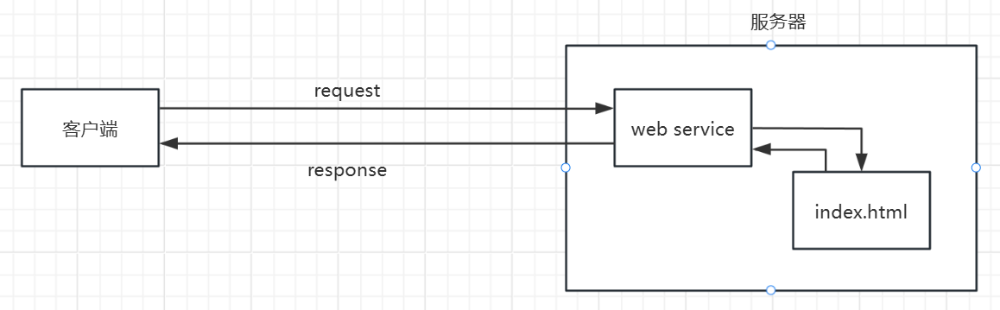
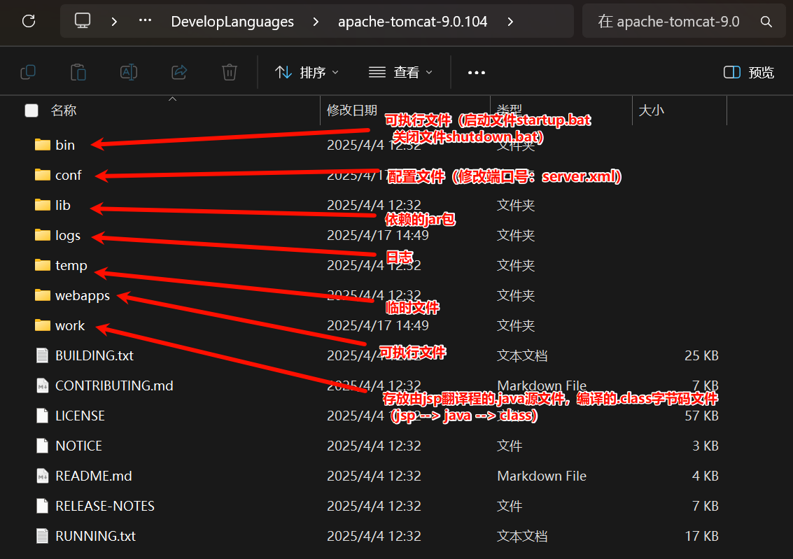

# JavaWeb

## 1、基本概念

- 静态web
  - html，css，js（伪动态）
  - 提供给所有人看的数据始终不会发生变化。
- 动态web
  - servlet/jsp，asp，php
  - 提供给所有人看的数据会发生变化，每个人在不同的时间，不同的地点看到的信息不同。

## 2、web应用程序

- 统一的web资源会被放在一个同一文件夹下，web应用程序 ---> Tomcat ：服务器
- 一个web应用程序由多个部分组成（静态web，动态web）
  - html，css，js
  - jsp，servlet
  - java程序
  - jar包
  - 配置文件（Properties）

web应用程序编写完毕后，若想提供给外界访问：需要一个服务器来同一管理。

### 2.1 静态web

缺点：

- web页面无法动态更新，所有用户看到的都是同一个页面
  - 轮播图，点击效果   --->  伪动态
  - JavaScript
- 无法和数据库交互（数据无法持久化，用户无法交互）

### 2.2 动态web

缺点：

- 加入服务器的动态web资源出现错误，需要重新编写**后台程序**，重新发布。
  - 停机维护

优点：

- web页面可以动态更新，所有用户看到的都不是同一个页面
- 可以和数据库交互（数据持久化：注册，商品信息，用户信息...）

### 2.3 技术讲解

1. ASP：
   - 微软推出，在前端代码中嵌入VB脚本：业务逻辑代码：维护成本高
   - C#
   - IIS

2. PHP：
   - 开发速度快，功能强大，跨平台，代码简单
   - 无法承载大访问量（局限性）
3. JSP/Servlet：
   - B/S：浏览和服务器
   - C/S：客户端和服务器
     - sun公司主推的B/S架构
     - 基于java语言
     - 可承载三高问题：高可用、高并发、高性能
     - 语言像ASP， ASP ---> JSP ，加快市场强度

### 2.4 web服务器

**Tomcat 实际上运行JSP页面和Servle**t，具有处理HTML页面的功能，另外它还是一个Servlet和JSP容器，独立的Servlet容器是Tomcat的默认模式。Tomcat最新版本为11.0.0**。**

Tomcat 技术先进、性能稳定，而且免费。

#### Tomcat

## 3、Http

超文本传输协议（Hypertext Transfer Protocol，HTTP）是**一个简单的请求-响应协议**，它通常运行在[TCP](https://baike.baidu.com/item/TCP/33012?fromModule=lemma_inlink)之上。它指定了客户端可能发送给服务器什么样的消息以及得到什么样的响应。请求和响应消息的头以[ASCII](https://baike.baidu.com/item/ASCII/309296?fromModule=lemma_inlink)形式给出；而消息内容则具有一个类似[MIME](https://baike.baidu.com/item/MIME/2900607?fromModule=lemma_inlink)的格式。超文本传输协议是一种用于分布式、协作式和超媒体信息系统的应用层协议，是万维网WWW（World Wide Web）的数据通信的基础。

- 端口：80

### 3.1 两个时代

- Http/1.0：客户端与web服务器连接后，只能获得一个web资源，断开连接。
- Http/1.1：客户端可以与web服务器连接后，可以获得多个web资源。

### 3.2 Http请求

- 客户端 --- 发出请求 --- 服务器

#### 3.2.1 请求行

- 请求行中的请求方式：Get、Post、Head、Delete、Put、Tract...
  - get：请求能够携带的参数比较少，大小有限制，会在浏览器中的**URL地址栏中显示内容**，**不安全，但是高效**
  - post：请求能够携带的参数不受限制，大小无限制，**不会**在浏览器中的URL地址栏中**显示内容****，**安全，但是不高效**

#### 3.2.2 消息头

~~~jajva
Accept：告诉浏览器，它所支持的数据类型
Accept-Encoding：支持哪种编码格式GBK UTF-8 GB2312 IS08859-1
Accept-Language：告诉浏览器，它的语言环境
Cache-Control：缓存控制
connection：告诉浏览器，请求完成是断开还是保持连接
HOST：主机...
~~~

### 3.3 Http响应

- 服务器 --- 响应 --- 客户端

#### 3.3.1 响应体

~~~java
Accept：告诉浏览器，它所支持的数据类型
Accept-Encoding：支持哪种编码格式GBK UTF-8 GB2312 IS08859-1
Accept-Language：告诉浏览器，它的语言环境
Cache-Control：缓存控制
connection：告诉浏览器，请求完成是断开还是保持连接
HOST：主机...
Refresh：告诉客户端，多久刷新一次
Location：让网页重新定位。
~~~

#### 3.3.2 响应状态码

200：请求响应成功     200
3xx：请求重定向

- 重定向：你重新到我给你新位置去；

4xx：找不到资源         404

- 资源不存在；

5xx：服务器代码错误  500    502：网关错误

# 黑马JavaWeb课程

java优点：

- 跨平台
- 安全
- 高效
- api齐全
- 历史悠久

